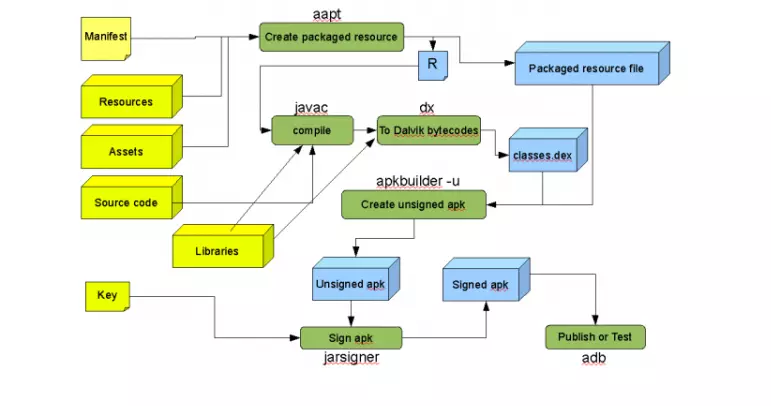

# <font color=#0099ff> **Android Studio 学习** </font>

> `@think3r` 2020-03-27 21:22:55
> 参考链接:
> 1. [【studio】整理了下studio中make Project、clean Project、Rebuild Project的区别](https://blog.csdn.net/u010693827/article/details/80060790)
> 2. [Android执行文件apk的组成结构](https://www.cnblogs.com/itrena/archive/2011/06/01/7434390.html)
> 3. [Android 开发者官方开发者指南](https://developer.android.google.cn/guide?hl=zh_cn)

### <font color=#FF4500> 0x00 Android Apk 构成 </font>

- `Kotlin`
  - Kotlin 是一种在 Java 虚拟机上运行的静态类型编程语言，被称之为 Android 世界的Swift，由 JetBrains 设计开发并开源。
  - Kotlin 可以编译成Java字节码，也可以编译成 JavaScript，方便在没有 JVM 的设备上运行。
  - 在Google I/O 2017中，Google 宣布 Kotlin 成为 Android 官方开发语言。

---

- apk : AndroidPackage 的缩写, 它其实是 zip 格式，但后缀名被修改为 apk;
- 其主要组成如下图所示:
```log
META-INF
res
lib
    armeabi-v7a
    arm64-v8a
    x86
assert
kotlin
- AndroidManifest.xml
- classes.dex
- resources.arsc
```

- `AndroidManifest.xml` 是每个应用都必须定义和包含的，它描述了应用的名字、版本、权限、引用的库文件等信息. APK 中的是经过压缩了的, 可通过 `java -jar AXMLPrinter2.jar AndroidManifest.xml` 命令 来打开;
- `classes.dex`  和
  - `classes.dex` 
    - 在 Android 系统中，dex 文件是可以直接在 Dalvik 虚拟机中加载运行的文件。通过 ADT，经过复杂的编译，可以把 java 源代码转换为 dex 文件。 
    - 那么这个文件的格式是什么样的呢？为什么 Android 不直接使用 class 文件，而采用这个不一样文件呢？ 其实它是针对嵌入式系统优化的结果，Dalvik 虚拟机的指令码并不是标准的 Java 虚拟机指令码，而是使用了自己独有的一套指令集。如果有自己的编译系统，可以不生成 class 文件， 直接生成 dex 文件。
    - dex 文件中共用了很多类名称、常量字符串，使它的体积比较小，运行效率也比较高。但归根到底，Dalvik 还是基于寄存器的虚拟机的一个实现。
    - 最终生成的 dalvik 字节码, 其中的数据结构自行查找;
  - ``
- `META-INF` 目录 :
  - `META-INF` 目录下存放的是签名信息，用来保证 apk 包的完整性和系统的安全。
  - 生成 APK 文件时, 会对所有要打包的文件做一个校验计算，并把计算结果放在META-INF目录下。而安装 apk 包时，应用管理器会按照同样的算法对包里的文件做校验，如果校验结果与 META-INF 下的内容不一致，系统就不会安装这个 apk。这就保证了 apk 包里的文件不能被随意替换。
    - 比如拿到一个apk包后，如果想要替换里面的一幅图片，一段代码， 或一段版权信息，想直接解压缩、替换再重新打包，基本是不可能的。
  - <font color=#EA00DA>**Android 具体的加密算法**</font>
- `smali` 文件:
  - apk 文件通过 apktool 反编译出来的都有一个 smali 文件夹，里面都是以 .smali 结尾的文件。
  - Dalvik VM 与 JVM 的最大的区别之一就是 Dalvik VM 是基于寄存器的而 JVM 是基于栈的. Dalvik 有专属的文件执行格式 dex（dalvik executable），而 JVM 则执行的是 java 字节码。Dalvik VM 比 JVM 速度更快，占用空间更少.
  - 简单的说，smali 就是 Dalvik VM 内部执行的核心代码。smali 语言是 Davlik 的寄存器语言，语法上和汇编语言相似，
- `res` 和 `assets` 文件夹
  - 都可用于存放资源文件; 两者目录下的文件在打包后会原封不动的保存在apk包中，不会被编译成二进制。
  - 其中 res 目录中的资源只能存储在相应的子目录(如 res/layout、res/values 等)中，不能直接将资源存储在 res 目录中。assets 目录中的
资源可以任意存放，也可以建立任意层次的子目录。
  - res 目录中的所有资源都会在R类的相应子类中生成对应的 int 类型变量，需要使用这些变量来引用资源。 assets 目录中的资源需要直接使用文件名来引用.
- `lib` 文件夹
  - 各种不同版本的库文件.
- `resources.arsc`
  - 编译后的二进制资源文件。通常本地化、汉化资源存储在该文件文件中。




## <font color=#009A000> 0x01 build 选项 </font>

1. `Make Project`：编译 Project 下所有 Module，一般是自上次编译后 Project 下有更新的文件，不生成 apk。
2. `Make Selected Modules` ：编译指定的 Module，一般是自上次编译后 Module 下有更新的文件，不生成 apk。
3. `Clean Project` ：删除之前编译后的编译文件，并重新编译整个Project，比较花费时间，不生成apk。
4. `Rebuild Project` ：先执行 Clean 操作，删除之前编译的编译文件和可执行文件，然后重新编译新的编译文件，不生成 apk，这里效果其实跟 Clean Project 是一致的，这个不知道Google搞什么鬼～～
5. `Build APK`：前面 4 个选项都是编译，没有生成 apk 文件，如果想生成 apk，需要点击 Build APK。
6. `Generate Signed APK` ：生成有签名的 apk。

注意:

- 平时小的改动直接用 `Make Project` 就可以，可以看到只有它有快捷方式，表明这个功能要经常用。对于一些大的改动比如更新 `lib` ，大功能修改等，用 `Clean` 或 `Rebuild` ，毕竟这两个编译起来要费时间.

