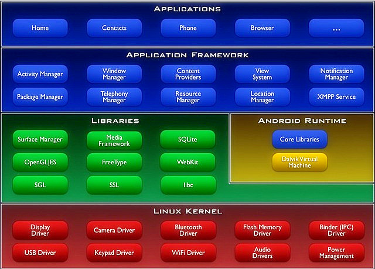

#  **安卓 Native**  

> `@think3r` 2019-01-18 22:02:19

##  0x01 openGL  

- [OpenGL ES总结（一）OpenGL 初识](https://blog.csdn.net/hejjunlin/article/details/61615215)

##  0x02 Android 开发中的 native 层与 Java 层  

> 1.  [ JNI开发中native层与Java层的交互](https://blog.csdn.net/u011452747/article/details/51521023)
> 2. [android 系统基本架构-软件层次](https://blog.csdn.net/wumingqian_137229/article/details/52845955)
- 安卓 四大层次简介:
    - Android 的层次分大概 4 层: java 应用程序，java 框架，本地框架和 java 运行环境，Linux 内核空间;
    - Java 应用程序无需过多解释，基本可以理解为各个 App，由 Java 语言实现。
    - Java 框架层就是常说的 Framework，这层里东西很多也很复杂，比如说主要的一些系统服务如 ActivityManagerService、PackageManagerService 等，我们编写的 Android 代码之所以能够正常识别和动作，都要依赖这一层的支持。这一层也是由 Java 语言实现;
    - Native 层就是本地框架层:
        - Native 层这部分常见一些本地服务和一些链接库等。这一层的一个特点就是通过 C 和 C++ 语言实现。
        - 比如我们现在要执行一个复杂运算，如果通过 java 代码去实现，那么效率会非常低，此时可以选择通过 C 或 C++ 代码去实现，然后和我们上层的 Java 代码通信（这部分在 android 中称为 jni 机制）。
        - 又比如我们的设备需要运行，那么必然要和底层的硬件驱动交互，也要通过 Native 层。
    - Linux 内核空间这部分顾名思义，就是 Kernel 部分;
    

- 第一、操作系统层（OS）

    - Android 对操作系统的使用包括核心和驱动程序两部分;
    - 核心指的是 Linux 内核, Linux Kernel 也作为硬件和软件之间的抽象层，它隐藏具体硬件细节而为上层提供统一的服务。
    - 驱动, 则是一些与移动设备相关的驱动程序。主要的驱动有：
        - 显示驱动（Display Driver）：常用基于 Linux 的帧缓冲（Frame Buffer）驱动
        - Flash 内存驱动（Flash Memory Driver）
        - 照相机驱动（Camera Driver）：常用基于 Linux 的 v4l（Video for ）驱动。
        - 音频驱动（Audio Driver）：常用基于 ALSA（Advanced Linux Sound Architecture，高级 Linux 声音体系）驱动
        - WiFi 驱动（Camera Driver）：基于 IEEE 802.11 标准的驱动程序
        - 键盘驱动（KeyBoard Driver）
        - 蓝牙驱动（Bluetooth Driver）
        - Binder IPC 驱动： Andoid 一个特殊的驱动程序，具有单独的设备节点，提供进程间通讯的功能。
        - Power Management（能源管理）

- 第二、各种库（Libraries）和Android 运行环境（RunTime）
    - 本层次对应一般嵌入式系统，相当于中间件层次。Android的本层次分成两个部分一个是各种库，另一个是 Android 运行环境。本层的内容大多是使用 C++ 实现的。Android 的各种库一般是以系统中间件的形式提供的，它们均有的一个显著特点就是与移动设备的平台的应用密切相关。
        - C 库：C 语言的标准库，这也是系统中一个最为底层的库，C 库是通过 Linux 的系统调用来实现。
        - 多媒体框架（MediaFrameword）：这部分内容是 Android 多媒体的核心部分，基于 PacketVideo （即 PV）的 OpenCORE.
        - SSL：即Secure Socket Layer位于TCP/IP协议与各种应用层协议之间,为数据通讯提供安全支持。
        - SGL: 基本的 2D 图形引擎;
        - OpenGL ES 1.0 ：本部分提供了对3D的支持。
        - SQLite：一个通用的嵌入式数据库;
        - WebKit：网络浏览器的核心;
        - FreeType：位图和矢量字体的功能;
    - Android 运行环境主要指的虚拟机技术—— Dalvik。Dalvik 虚拟机和一般 JAVA 虚拟机（Java VM）不同，它执行的不是 JAVA 标准的字节码（bytecode ）而是 Dalvik 可执行格式（.dex）中执行文件。在执行的过程中，每一个应用程序即一个进程（Linux 的一个 Process）。    二者最大的区别在于 Java VM 是以基于栈的虚拟机（Stack-based），而 Dalvik 是基于寄存器的虚拟机（Register-based）。显然，后者最大的好处在于可以根据硬件实现更大的优化，这更适合移动设备的特点。 
        - 每一个 Android 应用程序是 Dalvik 虚拟机中的实例，运行在他们自己的进程中。Dalvik 虚拟机设计成，在一个设备可以高效地运行多个虚拟机。Dalvik 虚拟机可执行文件格式是 .dex，dex 格式是专为 Dalvik 设计的一种压缩格式，适合内存和处理器速度有限的系统。
        - 大多数虚拟机包括JVM都是基于栈的，而Dalvik虚拟机则是基于寄存器的。dx 是一套工具，可以將 Java .class 转换成 .dex 格式。一个dex文件通常会有多个.class。由于dex有時必须进行最佳化，会使文件大小增加1-4倍，以ODEX结尾。（注意，.class转换成.dex文件的过程中，android是会对其进行优化的，以让其更适应小内存环境）

- 第三、应用程序框架（Application Framework）
    - Android 的应用程序框架为应用程序层的开发者提供 APIs，它实际上是一个应用程序的框架。由于上层的应用程序是以 JAVA 构建的，因此本层次提供的首先包含了 UI 程序中所需要的各种控件：
        - 举个栗子:  Views (视图组件)包括 lists(列表), grids(栅格), text boxes(文本框), buttons(按钮)等。甚至一个嵌入式的 Web 浏览器。
    - 一个Andoid的应用程序可以利用应用程序框架中的以下几个部分：
        - Activity （活动）
        - Broadcast Intent Receiver （广播意图接收者）
        - Service （服务）
        - Content Provider （内容提供者）
- 第四、应用程序（Application）
    - Android 的应用程序主要是用户界面（User Interface）方面的，通常以 JAVA 程序编写，其中还可以包含各种资源文件（放置在 res 目录中）JAVA 程序及相关资源经过编译后，将生成一个 APK 包。Android 本身提供了主屏幕（Home），联系人（Contact），电话（Phone），浏览器（Browers）等众多的核心应用。同时应用程序的开发者还可以使用应用程序框架层的 API 实现自己的程序。这也是 Android开源的巨大潜力的体现。

##  0x03 JNI,  Andoid NDK 与 SDK  

> [sdk 与 ndk的区别](https://blog.csdn.net/ffmxnjm/article/details/52159535)

- android sdk （Android Software Development Kit, 即 android 软件开发工具包）可以说只要你使用 java 去开发 Android 这个东西就必须用到。他包含了 SDK Manager 和 AVD Manage，对于 android 系统的一些开发版本的管理以及模拟器管理。它只能运行纯 java 程序，有了它模拟器才可以使用。

- 而 ndk （Native Development Kit, , 即本地开发工具包）跟 sdk 差不多的是它也是一个开发工具包。用它开发 c/c++ 是很方便的。他有一个强大的编译集合。Java 调 C、C++（jni 接口），是一些 java 如何调 C 的代码。它会把 C 代码编译成一个 .SO 的动态库，通过 jni 接口用 java 代码去调用它，有了它我们可以直接在 android 代码中去添加 C 代码。 NDK 是属于 Android 的, 与 Java 并无直接关系。
    - NDK (native development kit) 是一套工具集合，利用内置的交叉编译器通过 .mk 文件帮你把 C/C++ 代码编译出适应各种 cpu 架构的  .so 库, 通过 jni 标准你可以调用这些库里的方法, 这样的好处是避免的多种 cpu 架构的适配，把一些机密的代码用 C/C++ 写进 .so 中也提高了安全性。

- 很早以前 android 是只有 sdk 的。并没有 ndk。这就意味着一旦 android 的开发者要使用 c/c++ 的三方库或者需要用到 c/c++ 就必须使用非官方的法子，用 java 的 jni 去调用 c/c++。就像耍小聪明走后门一样。而 ndk 的出现就意味着 jni 调用的这种方法转正了变成官方了以后你不需要再走后面大路正面随你走。 
    - 如: 如果要操作底层直接操作内存，操作地址那不得不去使用 c/c++ 因为 java 这块想做这些有点困难。所以 ndk 是必须需要出现的。对于 android 来说 sdk 和 ndk 是同种语言的 2 种不同时期的必须品。

- JNI 是 Java Native Interface 缩写,即 java 本地接口。java 通过这个协议就可以调用外部的 C/C++ 方法。JNI 是属于 Java 的, 与 Android 无直接关系。在 Window s下面用 JAVA 做开发也经常会用到JNI，例如：读写系统注册表等。

- JNI 关键字: 呕心沥血 Android studio 使用JNI 实例; JNI 入门教程

<!------------------分页符------------------->

