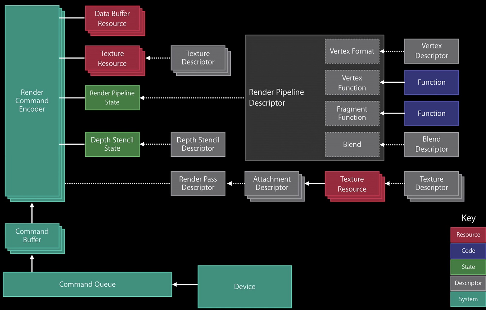
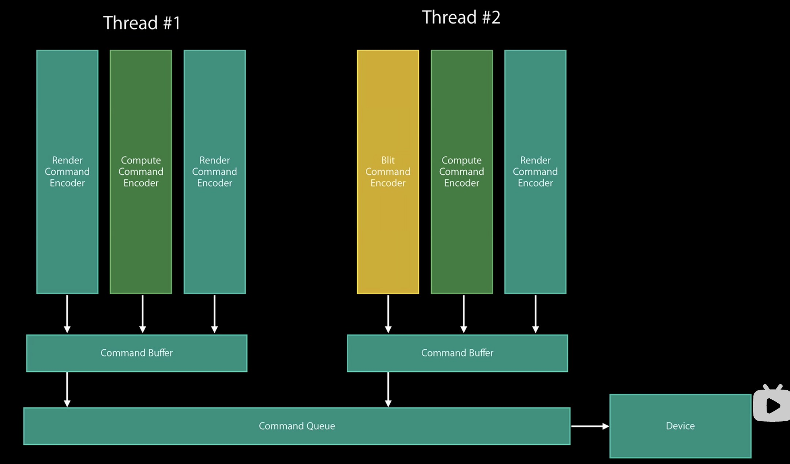
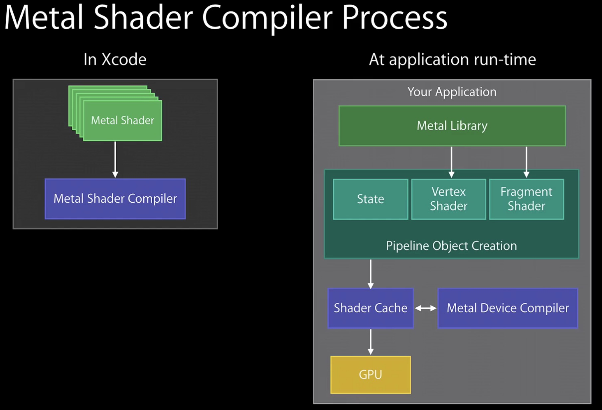

#  **learn metal** 

> `@think3r` 2023-01-12 11:23:40
> 1. [Metal、Vulkan、Direct3D 12三大图形引擎架构演进](https://www.cnblogs.com/taylorshi/p/15945916.html)
> 2. [3D渲染引擎-part2- 深入理解图形API之 opengl & metal & vulkan](https://zhuanlan.zhihu.com/p/528801461?utm_id=0)
> 3. [Working with Metal: Overview](https://developer.apple.com/videos/play/wwdc2014/603/)
> 4. [Processing HDR Images with Metal](https://developer.apple.com/documentation/metal/hdr_content/processing_hdr_images_with_metal?language=objc)
> 5. [Explore HDR rendering with EDR](https://developer.apple.com/videos/play/wwdc2021/10161/)
>    - [Apple：EDR是如何工作的？HDR渲染之道 | Explore HDR rendering with EDR](https://www.bilibili.com/video/BV1hT4y1o7r6/?spm_id_from=333.337.search-card.all.click&vd_source=471837a8669f91a06fea91667e4334ae)
> 6. [Display HDR video in EDR with AVFoundation and Metal](https://developer.apple.com/videos/play/wwdc2022/110565)
> 7. TODO : github-code :
>    - [https://github.com/loyinglin/LearnMetal.git](https://github.com/loyinglin/LearnMetal.git) 
>    - [https://github.com/jiangxh1992/MetalTutorialDemos.git]([https://](https://github.com/jiangxh1992/MetalTutorialDemos.git))

问题 :

1. 使用的 metal 版本, 使用的场景. opengl 兜底?
   1. Android 使用 vulkan ?
2. metal 单线程还是多线程.
3. metal 效率上的提升 ?
4. 纹理 :
   1. `CVMetalTextureCacheCreateTextureFromImage` 转换 `pixelBuffer` ?
   2. `CVMetalTextureCacheCreate`

##  0x00 简介 

**低级别的图形 API 和驱动开销**

1. Metal 是由苹果公司所开发的一个应用程序接口(API)，兼顾图形与计算功能，面向底层、低开销的硬件加速。其类似于将 OpenGL 与 OpenCL 的功能集成到了同一个 API 上，最初支持它的系统是 `iOS8`。Metal 使得 iOS 可以实现其他平台的类似功能，例如 Khronos Group 的跨平台 Vulkan 与 Microsoft Windows 上的 Direct 3D 12。
   - Metal 也通过引入计算着色器来进一步提高 GPGPU 编程的能力。
   - Metal 使用一种基于 C++ 11 的新着色语言，其实现借助了 Clang 和 LLVM。
2. 支持情况 :
   1. 2014年6月2日，Metal 开始支持 iOS 设备（仅支持 AppleA7 或更新款处理器的 iPhone、iPad）；
   2. 2015年6月8日，Metal 开始支持运行 OS X El Capitan 的 Mac 设备（仅 2012 年中或更新款机种）。
   3. 2017年6月5日，Apple 于 WWDC 宣布了 Metal 的第二个版本，支持 macOS High Sierra、`iOS 11` 和 tvOS 11。
      - Metal 2 不是 Metal 的独立 API，并且由需要的硬件支持。
      - Metal 2在Xcode中实现了更高效的分析和调试，加速了机器学习、降低了 CPU 工作负载、支持 macOS 上的虚拟现实以及 Apple A11 处理器的特性。
   4. 2019年6月3日，Metal API 更新到第三个版本，支持 macOS Catalina、`iOS 13` 和iPadOS 13。
   5. 2020 年的苹果全球开发者大会(WWDC)上，苹果宣布将 Mac 迁移到Apple Silicon。
      - 使用 Apple Silicon 的 Mac 将使用 Apple GPU，支持之前在 macOS 和 iOS 上实现的特色功能，并将能够利用为 Apple GPU 架构所定制的基于图块的延迟渲染（TBDR）功能
3. 概述 :
   1. 图形处理器(GPU)被设计用来快速渲染图形和执行数据并行计算。当你需要与设备上可用的 GPU 直接通信时，请使用 Metal 框架。渲染复杂场景或进行高级科学计算的应用程序可以利用这种力量来实现最大的性能。这类应用包括
      1. 渲染复杂 3D 环境的游戏
      2. 视频处理应用程序，如 Final Cut Pro
      3. 数据处理应用程序，如那些用于执行科学研究的应用程序

##  0x01 

- `MTKView`
  - MTKView 封装了 Metal 的基本功能，隐藏了配置 Metal 的一些操作，省去了开发者配置的麻烦，开发者只需要将精力花费在图形渲染即数据准备上就可以
  - MTKView 使用 `CAMetalLayer` 来管理 Metal 可绘制对象，通过 `MTLRenderPassDescriptor` 对象可以将内容渲染到一个纹理中。
    - CAMetalLayer 提供 MTKView 视图的绘图能力。在渲染器过程中，需要实现 `MTKViewDelegate` 协议来实现与 MetalKit 视图交互。
  - MTKView 支持三种绘制模式：
    - 定时更新, 视图根据内部计时器重绘其内容。默认情况下使用这个绘制方式，初始化时需要将 isPaused 和 enableSetNeedsDisplay 都设置为 false。游戏和更新的动画内容常用这种模式。
    - 绘制通知, 当调用 setNeedsDisplay() 或者 当某些内容使其内容无效时，视图会重绘自身。在这种情况下，将 isPaused 和 enableSetNeedsDisplay 设置为 true。这种模式适用于具有更传统工作流程的应用程序，更新只会在数据更改时发生，而不会定期更新。
    - 显式绘制, 当显式调用 draw() 方法时，视图才会重绘其内容。这种模式下，需要将 isPaused 设置为 true 并将 enableSetNeedsDisplay 设置为 false。一般使用此模式来创建自定义工作流程
  - 无论使用哪一种绘图模式，当视图需要更新其内容时，在子类重写 draw(:) 方法时，它会调用 draw(:) 方法，否则在视图的委托上调用 draw(in:) 方法。

##  0x02 设计模型 

###  0x03 EDR 

- EDR : Extended Dynamic Range 拓展动态范围
  - HDR representation(HDR 呈现)
  - HDRrenderingtechnology(HDR 渲染技术)

##  0x0n 路线演进 

1. 采集摄像头渲染
   - 核心能力验证 : `CVMetalTextureCacheCreateTextureFromImage` 转换 `pixelBuffer`
2. 能渲染 SDR 视频, 并插入播放器架构
   - 补足业务需求, 截图, 比例, VR 等待
3. 能渲染系统 HDR
4. 能渲染 HDR-Vivid
