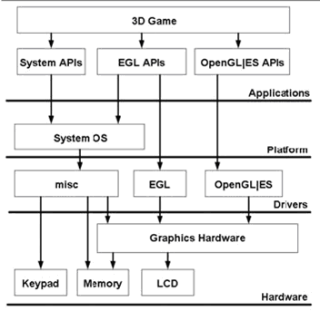

#  **EGL** 

> `@think3r` 2020-04-04 10:55:40  
> 参考链接:
> 1. [EGL接口介绍（转）](https://www.cnblogs.com/wanqieddy/archive/2011/11/24/2261457.html)
> 2. [EGL 1.0 学习笔记](https://blog.csdn.net/djzhao/article/details/79936973)
> 3. [EGL教程汇总](https://blog.csdn.net/u013467442/article/details/44490631)
> 4. [OpenGL-ES EGL的 eglChooseConfig使用问题](https://blog.csdn.net/liminled/article/details/46504439)

##  0x00 EGL 介绍 

EGL 是为 OpenGL-ES 提供平台独立性而设计, 下图为其架构。

- OpenGL-ES 为附加功能和可能的平台特性开发提供了扩展机制，但仍然需要一个可以让 OpenGL-ES 和本地视窗系统交互且平台无关的层。即 : <u>EGL 是 OpenGL-ES 与本地 Window 系统之间的桥梁, 或者说 EGL 是 OpenGL-ES 和底层 Native 平台视窗系统之间的接口。</u>
  - OpenGL-ES 本质上是一个图形渲染管线的**状态机**，而 <u>EGL 则是用于监控这些状态以及维护 Frame buffer 和其他渲染 Surface 的外部层</u> 。
  - OpenGL-ES 图形管线的状态被存储于 EGL 管理的一个 **Context** 中。 Frame Buffers 和其他绘制 Surfaces 通过 EGL API 创建、管理和销毁。EGL 同时也控制和提供了对设备显示和可能的设备渲染配置的访问。
- 由于 OpenGL ES 是跨平台的，引入 EGL 就是为了屏蔽不同平台上的区别。本地窗口相关的 API 提供了访问本地窗口系统的接口，EGL 提供了创建渲染表面，接下来 OpenGL ES 就可以在这个渲染表面 Surface 上绘制，同时提供了图形上下文(context)，用来进行状态管理。
  - Rendering Context 是 OpenGL-ES 的状态机;
  - Surface 是 OpenGL-ES 绘图的 “画布”;
    - 一个 Surface 就是一个对象，该对象持有一群像素（pixels），这些像素是要被组合到一起显示到屏幕上的。你在手机屏幕上看到的每一个 window（如对话框、全屏的activity、状态栏）都有唯一一个自己的 surface，window 将自己的内容（content）绘制到该 surface 中。Surface Flinger 根据各个 surface 在 Z 轴上的顺序（Z-order）将它们渲染到最终的显示屏上。
    - 一个 surface 通常有两个缓冲区以实现双缓冲绘制：当应用正在一个缓冲区中绘制自己下一个 UI 状态时，Surface Flinger可以将另一个缓冲区中的数据合成显示到屏幕上，而不用等待应用绘制完成。
    - 创建 surface 则需要 window.
      - 一个 window 恰如你在计算机中看到的一个 window。*它拥有唯一一个用以绘制自己的内容的 surface。* 应用通过 Window Manager 创建一个 window，Window Manager 为每一个 window 创建一个 surface，并把该 surface 传递给应用以便应用在上面绘制。应用可以在 surface 上任意进行绘制。对于 Window Manager 来说，surface 就是一个不透明的矩形而已。

##  0x01 数据类型概览 

- **Display:**
  - Display 是 OpenGL-ES 应用运行平台的物理显示器的抽象;
  - 是图形显示设备（显示屏）的抽象表示。大部分 EGL 函数都要带一个 Display 作为参数
- **Rendering Context:**
  - OpenGL-ES 状态机，由 EGL 创建、并与 Surface 关联;
    - Context 与 Surface 可以是一对一、多对一、一对多的关系
  - Rendering Context 含有 OpenGL-ES 的客户端和服务器端状态;
  - **<u>Rendering Context 存在于客户端的地址空间。每个线程在同一时刻只能使用 1 个 Rendering Context，每个 Rendering Context 在同一时刻只能被 1 个线程使用;</u>**
- **Surface:** OpenGL-ES 绘图的 “画布”, 绘图缓冲(drawing surface)。
  - EGL/OpenGL-ES 有 3 种 Surface;
    - window - 用于屏上（onscreen）渲染;
    - pbuffer - 用于离屏（offscreen）渲染;
    - pixmap - 离屏渲染，但本地渲染 API 也可以访问;
  - OpenGL 支持 2 种渲染模式：
    - back buffered: : 绘图的 color buffer 由 EGL 创建和管理，绘图完成后，EGL 将后台 color buffer 交换/拷贝到窗口上;
    - single buffered : 其 color buffer 为本地 Pixmap，EGL 能使用但不维护。OpenGL-ES 绘图后，像素直接在 Surface 上呈现;
  - window 和 pbuffer Surface 是 back buffered 模式，pixmap Surface 是 single buffered 模式;
- **Config:** 
  - 用于创建 Surface，包含了 Surface 的各个 buffer 的创建参数:
    - color buffer;
    - depth buffer;
    - multisample buffer;
    - stencil buffer; 
- 相互之间的关系概括
  - 与同一 Display 关联的 Rendering Context 和 Surface 才可以相互关联;
  - 一个 Rendering Context 可以向多个 Surface 绘图，多个 Rendering Context 可以向同一个 Surface 绘图;
  - 每个 Surface 有其独立的 buffers;

##   0x02 EGL 数据类型 

EGL 包含了自己的一组数据类型，同时也提供了对一组平台相关的本地数据类型的支持。这些 Native 数据类型定义在 EGL 系统的头文件中。一旦你了解这些数据类型之间的不同，使用它们将变得很简单。多数情况下，为保证可移植性，开发人员将尽可能使用抽象数据类型而避免直接使用系统数据类型。通过使用定义在 EGL 中 Native 类型，可以让你写的 EGL 代码运行在任意的 EGL 的实现上。** Native EGL 类型说明如下**：

- `NativeDisplayType` : Native 平台显示数据类型，标识你所开发设备的物理屏幕
- `NativeWindowType` : Native 平台窗口数据类型，标识系统窗口
- `NativePixmapType` : 可以作为 Framebuffer 的系统图像（内存）数据类型，该类型只用于离屏渲染
- `EGLDisplay` : 系统显示 ID 或句柄
- `EGLSurface` : 系统窗口或 frame buffer 句柄
- `EGLConfig` : Surface 的 EGL 配置
- `EGLContext` : OpenGL-ES 图形上下文

- <u>**EGLDisplay**</u>
  - EGLDisplay 是一个关联系统物理屏幕的通用数据类型。对于 PC 来说， Display 就是显示器的句柄。
  - 不管是嵌入式系统或 PC ，都可能有多个物理显示设备。为了使用系统的显示设备， EGL 提供了 EGLDisplay 数据类型，以及一组操作设备显示的 API 。
  - 获取 Native Display : `EGLDisplay eglGetDisplay (NativeDisplayType display);`
    - `display` 参数是 native 系统的窗口显示 ID 值。如果你只是想得到一个系统默认的 Display ，你可以使用 `EGL_DEFAULT_DISPLAY` 参数。
    - 如果系统中没有一个可用的 native display ID 与给定的 display 参数匹配，函数将返回 `EGL_NO_DISPLAY` ，而没有任何 Error 状态被设置。

- <u>**Initialization 初始化**</u>
  - 和很多视窗 API 类似， EGL 在使用前需要初始化，因此每个 `EGLDisplay` 在使用前都需要初始化。
  - 初始化 `EGLDisplay` 的同时，你可以得到系统中 EGL 的实现版本号。了解当前的版本号在向后兼容性方面是非常有价值的。嵌入式和移动设备通常是持续的投放到市场上，所以你需要考虑到你的代码将被运行在形形色色的实现上。通过动态查询 EGL 版本号，你可以为新旧版本的 EGL 附加额外的特性或运行环境。基于平台配置，软件开发可用清楚知道哪些 API 可用访问，这将会为你的代码提供最大限度的可移植性。
  - EGL 的函数原型： `EGLBoolean eglInitialize (EGLDisplay dpy, EGLint *major, EGLint *minor);`
    - 其中 dpy 应该是一个有效的 EGLDisplay 。
    - 函数返回时， major 和 minor 将被赋予当前 EGL 版本号。比如 EGL1.0 ， major 返回 1 ，minor 则返回 0 。给 major 和 minor 传 NULL 是有效的，如果你不关心版本号。

- <u>**`eglQueryString()`**</u>
  - 函数原型: `const char * eglQueryString (EGLDisplay dpy, EGLint name);`
  - `eglQueryString()` 函数是另外一个获取版本信息和其他信息的途径。通过 `eglQueryString()` 获取版本信息需要解析版本字符串，所以通过传递一个指针给 `eglInitializ()` 函数比较容易获得这个信息。
  - 注意调用 `eglQueryString()` 前必须先使用 `eglInitialize()` 初始化 `EGLDisplay` ，否则将得到 `EGL_NOT_INITIALIZED` 错误信息。
  - 参数 `name` 可以是 `EGL_VENDOR / EGL_VERSION / EGL_EXTENSIONS` 。这个函数最常用来查询有哪些 EGL 扩展被实现。所有 EGL 扩展都是可选的，如果你想使用某个扩展特性，请检查该扩展是否被实现了，而不要想当然假定已经实现了。如果没有扩展被实现，将返回一个 Null 字符串，如果给定的 name 参数无效，则会得到 `EGL_BAD_PARAMETER` 错误信息。
  
- <u>**EGL Configurations**</u>
  - EGLConfigs 是一个用来描述 `EGL surface` 配置信息的数据类型。要获取正确的渲染结果， Surface 的格式是非常重要的。根据平台的不同，surface 配置可能会有限制，比如某个设备只支持 16 位色深显示，或是不支持 stencil buffer ，还有其他的功能限制或精度的差异。
  - 函数原型: `EGLBoolean eglGetConfigs (EGLDisplay dpy, EGLConfig *configs,EGLint config_size, EGLint *num_config);`
    - 参数 configs 将包含在你的平台上有效的所有 EGL framebuffer 配置列表。支持的配置总数将通过 num_config 返回。实际返回的 configs 的配置个数依赖于程序传入的 config_size 。如果 `config_size < num_config` ，则不是所有的配置信息都将被返回。
    - 如果想获取系统支持的所有配置信息，最好的办法就是先给 `eglGetConfig` 传一个 NULL 的 configs 参数，num_config 将得到系统所支持的配置总数，然后用它来给configs 分配合适的内存大小，再用得到的 configs 来调用 eglGetConfig 。

##  0x03 EGL 构建过程 

1. 获取 Display: 
   - Display 代表显示器，在有些系统上可以有多个显示器，也就会有多个Display。
   - 获得 Display 要调用 `EGLboolean eglGetDisplay(NativeDisplay dpy)`，参数一般为 `EGL_DEFAULT_DISPLAY`。
   - 该参数实际的意义是平台实现相关的，在 X-Window 下是 XDisplay ID，在 MS Windows 下是 Window DC。

 1. 初始化 egl:
    - 调用 `EGLboolean eglInitialize(EGLDisplay dpy, EGLint *major, EGLint *minor)`，该函数会进行一些内部初始化工作，并传回 EGL 版本号 (major.minor)。

2. 选择 Config:
    - 所为 Config 实际指的是 FrameBuffer 的参数，在 MS Windows 下对应于 PixelFormat，在 X-Window 下对应 Visual。
      - 一般用 `EGLboolean eglChooseConfig(EGLDisplay dpy, const EGLint * attr_list, EGLConfig * config, EGLint config_size, EGLint *num_config)`
      - 其中 `attr_list` 是以 `EGL_NONE` 结束的参数数组，通常以 `id, value` 依次存放，对于个别标识性的属性可以只有 `id`，没有 `value`。
    - 另一个办法是用 `EGLboolean eglGetConfigs(EGLDisplay dpy, EGLConfig * config, EGLint config_size, EGLint *num_config)` 来获得所有 config。
    - Config 有众多的 Attribute，这些 Attribute 决定 FrameBuffer 的格式和能力，通过 `eglGetConfigAttrib()` 来读取，但不能修改。

3. 构造 Surface:
    - **Surface 实际上就是一个 FrameBuffer**，通过 `EGLSurface eglCreateWindowSurface(EGLDisplay dpy, EGLConfig confg, NativeWindow win, EGLint *cfg_attr)` 来创建一个 <u>**可实际显示的**</u> Surface。
    - 系统通常还支持另外两种 Surface： PixmapSurface 和 PBufferSurface，这两种都不是可显示的 Surface .
      - PixmapSurface 是保存在**系统内存**中的位图(离屏的 surface, <u>因为是系统内存,  所以需要 `map`), 同时它是 单缓冲 single buffer;</u>
      - PBuffer 则是保存在**显存**中的帧。Pbuffer 是 EGL 中与平台无关的离屏 surface，主要用于渲染成 texture，或者用于绘制比 window 更大的 surface。同样使用硬件加速。pbuffer 经常用来生成纹理映射。如果想渲染到纹理，常用更高效的 framebuffer 对象。
        - pbuffer 和普通的窗口渲染最大的不同是不能 swap，要么拷贝其值，要么修改其绑定成为纹理。
    - Surface 也有一些 attribute，基本上都可以故名思意: `EGL_HEIGHT, EGL_WIDTH, EGL_LARGEST_PBUFFER, EGL_TEXTURE_FORMAT, EGL_TEXTURE_TARGET, EGL_MIPMAP_TEXTURE, EGL_MIPMAP_LEVEL`，通过 `eglSurfaceAttrib()` 设置、 `eglQuerySurface()` 读取。

  > EGL defines several types of drawing surfaces collectively referred to as EGLSurfaces. These include: **windows**, used for onscreen rendering; **pbuffers**, used for offscreen rendering; and **pixmaps**, used for offscreen rendering into buffers that may be accessed through native APIs. EGL windows and pixmaps are tied to native window system windows and pixmaps.

4. 创建 Context。
    - OpenGL 的 pipeline 从程序的角度看就是一个状态机，有当前的颜色、纹理坐标、变换矩阵、绚染模式等一大堆状态，这些状态作用于程序提交的顶点 坐标等图元从而形成帧缓冲内的像素。
    - 在 OpenGL 的编程接口中，Context 就代表这个状态机，程序的主要工作就是向Context 提供图元、设置状态，偶尔也从 Context 里获取一些信息。
    - 函数原型 `EGLContext eglCreateContext(EGLDisplay dpy, EGLSurface write, EGLSurface read, EGLContext * share_list)` 来创建一个 Context。

---
