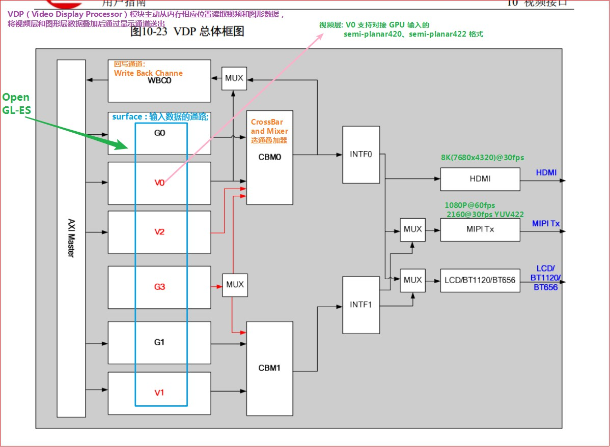

# <font color=#0099ff> **GLL 之外的东西** </font>

> `@think3r` 2020-04-04 14:39:43

## <font color=#009A000> 0x00 base </font>

一直很好奇嵌入式的视频输出框架的实现和 openGL 的关系, 而自己对于 linux 标准输入输出也是一知半解, 故此查阅资料, 并记录在此. (以海思为例.)



在硬件文档中找到了上述的描述: 可见主要分为 4 个层级:

- 最外层为外设, 包含 HDMI, LCD, MIPI 等硬件
- 其次为 INTF 中断层 ;
- 再然后为 选通叠加器层 CBM ;
- 最里面为软件可见层 surface 输入数据的通路: 其中 WBC0 为回写通道, G0 G1 G2 为图形层, V0 V1 V2 为视频层; 视频层和图形层的区别在于
  - 视频层位于最底层, 且不需要额外的初始化操作;
  - 图形层则是基于 hi_fb 实现, 需要对 `/dev/fb*` 节点进行初始化;

在海思 gpu demo 中有如下的描述:
> OpenGL-ES 是图形相关的绘制接口，它依赖 framebuffer 运行时，需要用户进入 `mpp/sample/gpu` ，使用make命令编译。请注意，GPU 的 sample 并不会自行打开 framebuffer，因此运行 GLES 的 sample 时，需要用户在后台运行一个 ARGB8888 格式的 `sample_hifb`。  
> 可以进入 `mpp/sample/hifb`，使用 `./sample_hifb 0 0 0` 命令，然后 `Ctrl+Z` 将 `sample_hifb` 放置到后台。<u>并且需要等 `sample_hifb` 创建出界面后, 才能放置到后台, 否则会出现 `EGL_NO_SURFACE` 的错误!</u>

再联想下安卓下的 openGL 开发经验, 一般的安卓设备都必须要有显示的, 于是上述一系列初始化的操作被系统都配置好了, 因而直接从 EGL 开始, 使用 openGL 便是可以直接显示的; 而 hisi 这边因为是更嵌入式的设备, 为了省电, 可能连基本的视频输出都没初始化, 于是需要运行 `sample_hifb` .

那么问题来了, 如果我需要在 hisi 上面直接显示的话, 我还需要什么? 经测试, 需要将 surface 及以后的通路全部打通 ! 包括:

1. 初始化 `MIP_SYS` 和 VB 等.
2. VO :
   - 配置 VO 参数 ;
   - start VO ;
3. HDMI :
   - 初始化 HDMI 设备 ;
   - 打开 HDMI 设备 ;
   - 配置 HDMI 参数 ;
   - start HDMI ;
4. hi_fb :
   - 配置 GO 层对应的 framebuffer 的参数;
   - 打开 `/dev/fb*` 设备;
   - `ioctrl` 操作 `fb` 设备 :
     - 关闭显示 ;
     - 配置原点 ;
     - 获取并配置屏幕参数, 主要是 `struct fb_var_screeninfo` 的配置;
     - 开启显示 ;

## <font color=#009A000> 0x02 HiFB 到底是什么</font>

- `Hisilicon Framebuffer`（以下简称 `HiFB`）是海思数字媒体处理平台提供的用于管理叠加图形层的模块，它不仅提供 Linux Framebuffer 的基本功能，还在 `Linux Framebuffer` 的基础上增加层间 colorkey、层间 colorkey mask、层间 Alpha、原点偏移等扩展功能.
  - **`Linux Framebuffer` 是一个子设备号对应一个显卡，HiFB 则是一个子设备号对应一个叠加图形层，** HiFB 可以管理多个叠加图形层，具体个数和芯片相关.
- `Linux Framebuffer` 提供同步时序、扫描方式、同步信号组织等控制方式（需要硬件支持），将物理显存的内容显示在不同的输出设备（如 PC 显示器、TV、LCD 等）上。目前 HiFB 不支持同步时序、扫描方式、同步信号组织等控制方式。
- Hi3559AV100 芯片的 HiFB 最多可以管理 3 个叠加图形层：对应的设备文件依次为 `/dev/fb0`、`/dev/fb1` 和 `/dev/fb2` 。
  - G0 只能在 DHD0 设备上显示; 支持压缩, 支持 colorKey, 不支持软鼠标;
  - G1 只能在 DHD1 设备上显示; 支持压缩, 支持 colorKey, 不支持软鼠标;
  - G2 可动态绑定在 DHD0/DHD1 上显示; 不支持压缩, 支持 colorKey, 不支持软鼠标;
- 通过模块加载参数，可以控制 HiFB 管理其中的一个或多个叠加图形层，并像操作普通文件一样操作叠加图形层.

## <font color=#009A000> 0x03 EGL 接口层面 </font>

一般在嵌入式设备上, EGL 接口必定要参与图层管理等, 那么, 他们到底是怎么交互的呢? 主要是通过下面这三个接口:

```c
 EGLSurface  eglCreateWindowSurface (
                        EGLDisplay dpy, 
                        EGLConfig config, 
                        EGLNativeWindowType win,
                        const EGLint *attrib_list);
 EGLSurface  eglCreatePbufferSurface (
                        EGLDisplay dpy, 
                        EGLConfig config,
                        const EGLint *attrib_list);
 EGLSurface  eglCreatePixmapSurface (
                        EGLDisplay dpy, 
                        EGLConfig config, 
                        EGLNativePixmapType pixmap,
                        const EGLint *attrib_list);
```

### <font color=#FF4500> hisi </font>

- 在用于显示的 `eglCreateWindowSurface` 接口中, 我们可以看到第三个参数 `EGLNativeWindowType win`, 其就是用来完成和显示框架的交互的.
- 通过 `find ./ -name "*.h" | xargs grep "EGLNativeWindowType" -n --color=auto`
  - 我们在 `EGL/eglplatform.h` 中找到了相关的定义:

```c
typedef fbdev_window * EGLNativeWindowType;

typedef EGLNativeWindowType NativeWindowType;
typedef EGLNativePixmapType NativePixmapType;
typedef EGLNativeDisplayType NativeDisplayType;

typedef EGLNativeWindowType NativeWindowType;
typedef EGLNativePixmapType NativePixmapType;
typedef EGLNativeDisplayType NativeDisplayType;

/* mali_fbdev_types.h 中定义如下: */
typedef struct fbdev_window
{
     unsigned short width;
     unsigned short height;
} fbdev_window;
```

- 可见, `EGLNativeWindowType` 实际上也就是一个存储宽高的结构体而已. 
- 真正需要的 hifb 的 ARGB8888 图形层, 则需要系统之外去维护.
  - 当创建的 ARGB8888 图形层小于实际 `EGLNativeWindowType` 中指定的图形层 或 未创建 hifb 图形层时, `eglCreateWindowSurface` 就会出现 `EGL_NO_SURFACE` 错误!
- 需要注意的是 :
  - `EGLNativeWindowType` 实际创建的是 GL 能够绘制的整个画布范围;
  - `glViewport()` 则是在上述画布中再次指定本次绘制的范围;

### <font color=#FF4500> android 中 NativeWindow 的相关定义 </font>


```c
/* eglplatform.h 中有如下定义 */
#elif defined(__ANDROID__) || defined(ANDROID)

struct ANativeWindow;
struct egl_native_pixmap_t;

typedef struct ANativeWindow*           EGLNativeWindowType;
typedef struct egl_native_pixmap_t*     EGLNativePixmapType;
typedef void*                           EGLNativeDisplayType;

/* EGL 1.2 types, renamed for consistency in EGL 1.3 */
typedef EGLNativeDisplayType NativeDisplayType;
typedef EGLNativePixmapType  NativePixmapType;
typedef EGLNativeWindowType  NativeWindowType;

/*
即: NativeWindowType -> EGLNativeWindowType -> ANativeWindow* -> 参考 openGL_Es之外的东西.h
*/
```

如向深入查看实现, 可参考 [EGL之外的东西](./EGL之外的东西.h)
