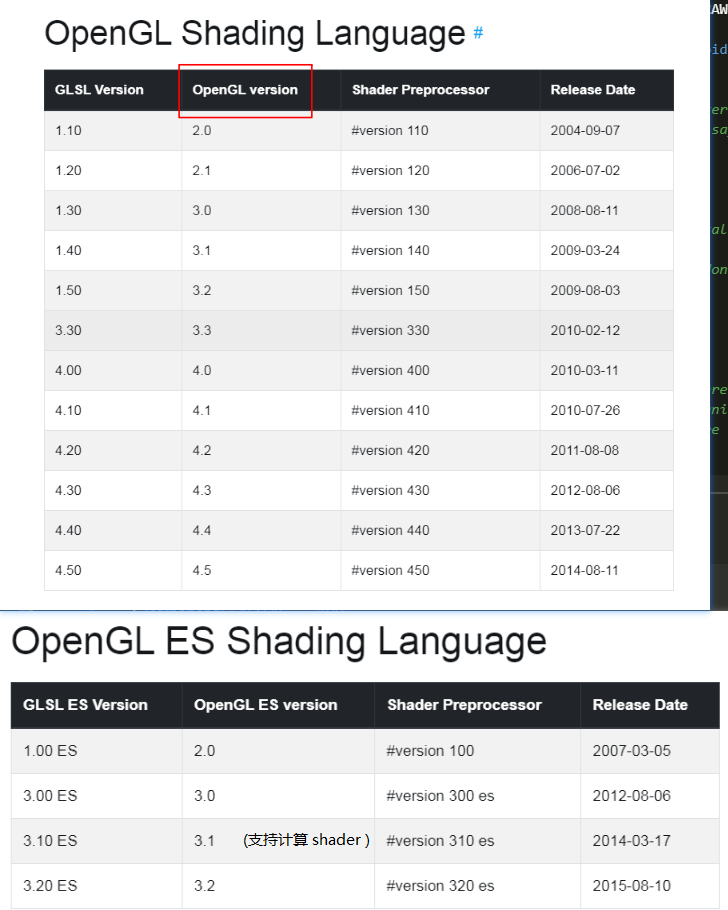

# <font color=#0099ff> **GLSL** </font>

> `@think3r` 2020-04-04 16:01:03 <br>
> 参考链接:
> 1. [learnopengl-CN 你好，三角形](https://learnopengl-cn.github.io/01%20Getting%20started/04%20Hello%20Triangle/) 
> 2. [GLSL Versions](https://github.com/mattdesl/lwjgl-basics/wiki/GLSL-Versions)
> 3. [Getting started with glsl](https://riptutorial.com/glsl)
> 4. [GLSL Versions和GLSL ES Versions 对比](https://www.cnblogs.com/beeasy/p/6339313.html)



## <font color=#009A000> shader 概述 </font>

- Shaders 在现代 OpenGL 中是个很重要的概念。应用程序离不开它，除非你理解了，否则这些代码也没有任何意义。
- Shaders 是一段 GLSL 小程序，运行在 GPU 上而非 CPU。它们使用 OpenGL Shading Language (GLSL) 语言编写，看上去像 C 或 C++，但却是另外一种不同的语言。使用 shader 就像你写个普通程序一样：写代码，编译，最后链接在一起才生成最终的程序。
- **Shaders 并不是个很好的名字，因为它不仅仅只做着色。只要记得它们是个用不同的语言写的，运行在显卡上的小程序就行。**
- 在旧版本固定管线的 OpenGL 中，shaders 是可选的。在现代 OpenGL 中，为了能在屏幕上显示出物体，shaders 是必须的。
- 一般有如下两种不同的着色器:
  - 在你的场景中，每个 **顶点** 都需要调用的程序，称为 **顶点着色器(Vertex shaders)** 。
    - 假如你在渲染一个简单的场景：一个长方形，每个角只有一个顶点。于是 vertex shader 会被调用四次。
    - 它负责执行：诸如灯光、几何变换等等的计算。得出最终的顶点位置后，为下面的片段着色器提供必须的数据。
  - 在你的场景中，大概每个像素都会调用的程序，称 **片段着色器(Fragment shaders)** 。
    - 在一个简单的场景，也是刚刚说到的长方形。这个长方形所覆盖到的每一个像素，都会调用一次 fragment shader。
    - 片段着色器的责任是计算灯光，以及更重要的是计算出每个像素的最终颜色。

### <font color=#FF4500> 着色器基础 </font>

- 虽然着色器是各自独立的小程序，但是它们都是一个整体的一部分，出于这样的原因，我们希望每个着色器都有输入和输出，这样才能进行数据交流和传递。
- 为了在 `顶点着色器` 中管理 `顶点数据` , 我们使用 `location` 这一元数据指定输入变量，这样我们才可以在 CPU 上配置顶点属性。
  - 你也可以忽略 `layout (location = 0)` 标识符，通过在 OpenGL 代码中使用 `glGetAttribLocation` 查询属性位置值 (Location)，但是我更喜欢在着色器中设置它们，这样会更容易理解而且节省你（和OpenGL）的工作量。
- `片段着色器` : 它需要一个 `vec4` 颜色输出变量，因为片段着色器需要生成一个最终输出的颜色。
  - 如果你在片段着色器没有定义输出颜色，OpenGL 会把你的物体渲染为黑色（或白色）。
- 如果打算从一个着色器向另一个着色器发送数据，我们必须在发送方着色器中声明一个输出，在接收方着色器中声明一个类似的输入。当类型和名字都一样的时候，OpenGL 就会把两个变量 `链接` 到一起，它们之间就能发送数据了（这是在链接程序对象时完成的）。
- Uniform 是一种从 CPU 中的应用向 GPU 中的着色器发送数据的方式，
  - 但 uniform 和顶点属性有些不同。首先，uniform 是全局的 (Global)。全局意味着 uniform 变量必须在*每个着色器程序对象*中都是独一无二的，而且它可以被着色器程序的任意着色器在任意阶段访问。
  - 第二，无论你把 uniform 值设置成什么，uniform 会一直保存它们的数据，直到它们被重置或更新。
  - *注意 :* 如果你声明了一个 uniform 却在 GLSL 代码中没用过，编译器会静默移除这个变量，导致最后编译出的版本中并不会包含它，这可能导致几个非常麻烦的错误，记住这点！
  - 使用:
    - 首先需要找到 `着色器中` uniform 属性的 `索引/位置值` 。
    - 当我们得到 uniform 的索引/位置值后，我们就可以更新它的值了。
    - *注意 :* 查询 uniform 地址不要求你之前使用过着色器程序，但是更新一个 uniform 之前你必须先使用程序（调用 `glUseProgram` )，因为它是在当前激活的着色器程序中设置 uniform 的。
- `vecn.xyzw`
- 向量重组: `vec4 differentVec = someVec.wxyx;`

## <font color=#009A000> GLSL 源码编译问题 </font>

> 参考链接 :
> 1. [objcopy命令介绍](https://blog.csdn.net/weixin_34236497/article/details/91508488)
> 2. [GNU Objcopy语法和使用](https://blog.csdn.net/linux12121/article/details/82932535)
> 3. [如何利用objcopy选项来填充生成的bin文件](https://my.oschina.net/hechunc/blog/3020177)
> 4. [GNU 工具 nm](http://blog.sina.com.cn/s/blog_5ec5eb330101d5k5.html)
> 5. [objcopy-gnu-doc](https://sourceware.org/binutils/docs/binutils/objcopy.html)

- 由于 GLSL 代码是在运行时编译的, 而输入编译器的是一个 GLSL 字符串源码 那么通常就有如下两种方式来完成:
  1. 将 GLSL 源码放置到单独的文件中, 使用时 `fread()` 读入内存中再编译,  
      - 优点: GLSL 源码可以进行高亮的操作, 便于编程;
      - 缺点: GLSL 源码会随着程序一块打包发布, 容易泄露程序逻辑;
  2. 将 GLSL 直接以字符串的方式放置到源码中, 可直接进行编译;
      - 优点: GLSL 源码不进行单独发布, 泄露风险稍小;
      - 缺点: GLSL 源码因为是字符串, 开发可能不大方便(高亮啥的没有);

- 于是我就想能不能将上述两个方法的优点都结合起来? 后来发现, GNU 的 `objcopy` 工具就能很好的解决这点;
  - 下方 `makefile` 中的三个选项可生成平台对应的 `.o` 文件;
    - `-I` 表示输入文件的格式;
    - `-O` 表示输出文件的格式, 这个执行 `objcopy` 查看其支持的格式;
    - `-B` --binary-architecture `<arch>`
  - `--rename-section .data=.rodata,alloc,load,readonly,data,contents` 将 GLSL 代码配置为只读;
    - 当加入上述只读选项时, 建议配合 `const` 修饰来保证安全, 否则 GLSL 代码被放置到了只读段, 而使用的指针地址则直接指向了只读段, 修改只读段中的数据会造成程序崩溃. 加入 const 后, 编译器可额外检查代码中静态的修改错误;
    - linux 中，gnu 工具 `nm` 用来列出目标文件的符号清单, 
      - `A` 该符号的值是绝对的，在以后的链接过程中，不允许进行改变。这样的符号值，常常出现在中断向量表中，例如用符号来表示各个中断向量函数在中断向量表中的位置;
      - `D` 该符号位于初始话数据段中。一般来说，分配到 data section 中。
      - `R` 该符号位于只读数据区。~~例如定义全局 `const int test[] = {123, 123}` ;则 `test` 就是一个只读数据区的符号。(存疑)~~
    - 当未加入上述配置选项时, nm 如下:

    ```log
    000000000000015f D _binary_src_vertShader_txt_end
    000000000000015f A _binary_src_vertShader_txt_size
    0000000000000000 D _binary_src_vertShader_txt_start
    ```

    - 当加入时, nm 如下:

    ```log
    000000000000015f R _binary_src_vertShader_txt_end
    000000000000015f A _binary_src_vertShader_txt_size
    0000000000000000 R _binary_src_vertShader_txt_start
    ```

  - `--pad-to` 和 `--gap-fill` 则分别表示对齐和对齐的填充
    - **GLSL 代码因为是字符串, 所以将对齐放大到了 `文件大小+1`, 且将最后一个字符填充 0, 来拟合字符串.** 否则会出现 fragShader 和 vertShader 混合到一个字符串的情况, 切记!
  - 注意: arm 平台下的 size 可能不能使用(引起崩溃), 但可用 `start - end` 来替代;

- `makefile` 局部:

```Makefile
OBJCOPY=objcopy

GLSL_Files = ./src/fragShader.txt  ./src/vertShader.txt
GLSL_Objs := $(GLSL_Files:.txt=.o)

GLSL_Flags := -I binary -O elf64-littleaarch64 -B aarch64
GLSL_Flags += --rename-section .data=.rodata,alloc,load,readonly,data,contents

# expr \( `stat --format=%s $<` + 4 \) / 4 \* 4 是为了计算文件大小, 并向上 4 对齐;

$(GLSL_Objs) : %o : %txt
	#echo size is $(shell expr `stat --format=%s $<`)
	$(OBJCOPY) $(GLSL_Flags) --pad-to=$(shell expr \( `stat --format=%s $<` + 4 \) / 4 \* 4 ) --gap-fill=0x00 $< $@

$(Target) : $(Objs) $(GLSL_Objs)
	$(CC) $(C_Flags) -o $(Target) $(Objs) $(GLSL_Objs) $(LIBS_WithPath)
```

- 程序中的使用:

```c
extern const char const _binary_src_vertShader_txt_start[];
extern const char const _binary_src_vertShader_txt_end[];
extern const char const _binary_src_fragShader_txt_start[];
extern const char const _binary_src_fragShader_txt_end[];

uint32_t size = _binary_src_fragShader_txt_end -_binary_src_vertShader_txt_start;
for(uint32_t i = 0; i < size; i++)
{
    printf("[%d] ", _binary_src_fragShader_txt_start[i]);
}
printf("\n");
```
