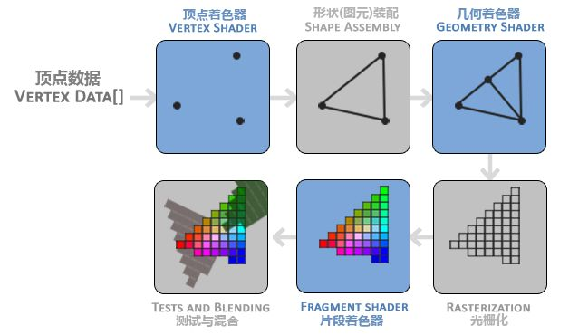

# <font color=#0099ff> **OGL 和 OGL-ES** </font>

> `@think3r` 2020-04-04 15:54:14 <br>
> 参考链接: <br>
> 1. [【Android】Android SurfaceFlinger之OpenGL-ES](https://blog.csdn.net/iEearth/article/details/54729848?locationNum=7&fps=1)
> 2. [Android OpenGL-ES 1.x 教程的Native实现](http://www.cnblogs.com/bpasser/archive/2011/09/25/2189941.html)
> 3. [最简单的视音频播放示例5：OpenGL播放RGB/YUV](https://blog.csdn.net/leixiaohua1020/article/details/40333583)

## <font color=#009A000> 0x00 OGL 一般使用流程 </font>

使用 OpenGL 播放视频最简单的情况下需要如下步骤：

- **初始化 :**
  - 初始化
  - 创建窗口
  - 设置绘图函数
  - 设置定时器
  - 初始化 Shader, 初始化 Shader 的步骤比较多，主要可以分为 3 步：创建 Shader，创建 Program，初始化 Texture。
     1. 创建一个 Shader 对象, Shader 有点类似于一个程序的编译器
         - 编写 Vertex Shader 和 Fragment Shader 源码。
             - 在这里用到了一种新的语言：OpenGL Shader Language, 简称 GLSL。它是一种类似于C语言的专门为 GPU 设计的语言，它可以放在 GPU 里面被并行运行。
         - 创建两个 shader 实例 。
         - 给 Shader实例指定源码。
         - 在线编译 shaer 源码。
     2. 创建一个 Program 对象, Program 有点类似于一个程序的链接器。
         - 创建 program。
         - 绑定 shader 到 program。
         - 链接 program。
         - 使用 porgram。
     3. 初始化 Texture。可以分为以下步骤。
         - 定义定点数组
         - 设置顶点数组
         - 初始化纹理;
- 循环显示画面
  - 调整显示位置，图像大小/  设置纹理;
  - 画图
  - 显示

PASS : 如果仅仅是向绘制三角形, 那么上述步骤中 texture 相关的部分都可以略去.

## <font color=#009A000> **0x01 openGL 构建原理** </font>

<u>**OpenGL的一大特性就是对扩展(Extension)的支持，**</u> 当一个显卡公司提出一个新特性或者渲染上的大优化，通常会以扩展的方式在驱动中实现。如果一个程序在支持这个扩展的显卡上运行，开发者可以使用这个扩展提供的一些更先进更有效的图形功能。通过这种方式，开发者不必等待一个新的 OpenGL 规范面世，就可以使用这些新的渲染特性了，只需要简单地检查一下显卡是否支持此扩展。通常，当一个扩展非常流行或者非常有用的时候，它将最终成为未来的 OpenGL 规范的一部分。

在 OpenGL 中，任何事物都在 3D 空间中，而屏幕和窗口却是 2D 像素数组，这导致 OpenGL 的大部分工作都是关于把 3D 坐标转变为适应你屏幕的 2D 像素。3D 坐标转为 2D 坐标的处理过程是由 OpenGL 的图形渲染管线（Graphics Pipeline，大多译为管线，实际上指的是一堆原始图形数据途经一个输送管道，期间经过各种变化处理最终出现在屏幕的过程）管理的。

图形渲染管线接受一组 3D 坐标，然后把它们转变为你屏幕上的有色 2D 像素输出。

- 图形渲染管线可以被粗划分为两个主要部分：
  - 第一部分把你的3D坐标转换为2D坐标，
  - 第二部分是把2D坐标转变为实际的有颜色的像素。
  - note: **2D 坐标和像素** 也是不同的，2D 坐标精确表示一个点在 2D 空间中的位置，而 2D 像素是这个点的近似值，2D 像素受到你的屏幕/窗口分辨率的限制。
- 图形渲染管线可以被细划分为几个阶段，每个阶段将会把前一个阶段的输出作为输入。所有这些阶段都是高度专门化的（它们都有一个特定的函数），并且很容易并行执行。正是由于它们具有并行执行的特性，当今大多数显卡都有成千上万的小处理核心，它们在 GPU 上为每一个（渲染管线）阶段运行各自的小程序，从而在图形渲染管线中快速处理你的数据。这些小程序叫做着色器(Shader)。

有些着色器允许开发者自己配置，这就允许我们用自己写的着色器来替换默认的。这样我们就可以更细致地控制图形渲染管线中的特定部分了，而且因为它们运行在 GPU 上，所以它们可以给我们节约宝贵的 CPU 时间。OpenGL 着色器是用 OpenGL 着色器语言(OpeGL Shading Language, GLSL)写成的，在下一节中我们再花更多时间研究它。



- 要注意蓝色部分代表的是我们可以注入自定义的着色器的部分。

1. 图形渲染管线的第一个部分是 **顶点着色器(Vertex Shader)**，它把一个单独的顶点作为输入。顶点着色器主要的目的是把 3D 坐标转为另一种 3D 坐标（后面会解释），同时顶点着色器允许我们对顶点属性进行一些基本处理。
2. **图元装配(Primitive Assembly)** 阶段将顶点着色器输出的所有顶点作为输入（如果是 `GL_POINTS`，那么就是一个顶点），并所有的点装配成指定图元的形状；本节例子中是一个三角形。图元装配阶段的输出会传递给几何着色器(Geometry Shader)。
   - 为了让 OpenGL 知道我们的坐标和颜色值构成的到底是什么，OpenGL 需要你去指定这些数据所表示的渲染类型。我们是希望把这些数据渲染成一个点？一个三角形？还是仅仅是一个长长的线？
   - 做出的这些提示叫做 图元(Primitive)，任何一个绘制指令的调用都将把图元传递给 OpenGL。这是其中的几个：`GL_POINTS、GL_TRIANGLES、GL_LINE_STRIP`。
3. **几何着色器** 几何着色器把图元形式的一系列顶点的集合作为输入，它可以通过产生新顶点构造出新的（或是其它的）图元来生成其他形状。其输出会被传入光栅化阶段 (Rasterization Stage). 
   - 这里几何着色器会把图元映射为最终屏幕上相应的像素，生成供片段着色器(Fragment Shader)使用的片段(Fragment)。
   - 在片段着色器运行之前会执行*裁切(Clipping)*。裁切会丢弃超出你的视图以外的所有像素，用来提升执行效率。
   - <u>**注 : OpenGL 中的一个片段是 OpenGL渲染一个像素所需的所有数据。**</u>
4. **片段着色器** 的主要目的是计算一个像素的最终颜色，这也是所有 OpenGL 高级效果产生的地方。通常，片段着色器包含 3D 场景的数据（比如光照、阴影、光的颜色等等），这些数据可以被用来计算最终像素的颜色。
5. 在所有对应颜色值确定以后，最终的对象将会被传到最后一个阶段，我们叫做 Alpha 测试和混合(Blending)阶段。这个阶段检测片段的对应的深度（和模板(Stencil)）值（后面会讲），用它们来判断这个像素是其它物体的前面还是后面，决定是否应该丢弃。这个阶段也会检查 alpha 值（alpha 值定义了一个物体的透明度）并对物体进行混合(Blend)。所以，即使在片段着色器中计算出来了一个像素输出的颜色，在渲染多个三角形的时候最后的像素颜色也可能完全不同。

可以看到，图形渲染管线非常复杂，它包含很多可配置的部分。然而，对于大多数场合，我们只需要配置顶点和片段着色器就行了。几何着色器是可选的，通常使用它默认的着色器就行了。

在现代 OpenGL 中，我们必须定义至少一个顶点着色器和一个片段着色器（因为 GPU 中没有默认的顶点/片段着色器）。出于这个原因，刚开始学习现代 OpenGL 的时候可能会非常困难，因为在你能够渲染自己的第一个三角形之前已经需要了解一大堆知识了。在本节结束你最终渲染出你的三角形的时候，你也会了解到非常多的图形编程知识。

---

## <font color=#009A000> [**0x02 点击此处阅读 shader 相关知识**](./GLSL.md) </font>

---

## <font color=#009A000> **0x03 理解 OpenGL 的客户端和服务端** </font>

> [OpenGL-客户端和服务器模式](https://www.jianshu.com/p/a9ffde5dd0b4)

任何一种 OpenGL 程序, 本质上都可以分为两部分:

- CPU 端运行的部分, 采用 C++ 之类的语言编写;
- GPU 端运行的部分, 使用 GLSL 语言编写;

首先明确下当今图像系统的构成:

- CPU + DDR; CPU 串行处理数据.
  - 一般的集显和 arm-soc 都采用上述这种形式;
- GPU + GPU_DDR(显存); GPU 并行处理数据, 有时候 GPU 还带有自己独立的显存!

OpenGL 是按照 `客户机->服务器` 模式设计的:

- 客户端：
  - 负责发送 OpenGL 命令;
  - CPU 上面存储的代码，比如 OpenGLApi，C 和 C++ 代码;
- 服务端：
  - 负责接收 OpenGL 命令并执行相应的操作;
  - 调用的是 GPU 芯片;

客户端是存储在 `CPU` 储存器中的，并且在 `应用程序` 中执行或者在主系统内存中驱动程序中执行。 `驱动程序` 会将 `渲染命令` 和 `数组` 组合起来，发送给 `服务器` 执行！

`服务器` 和 `客户端` 在功能上也是异步的。客户端不断的把数据块和命令块组合在一起输送到缓冲区，然后缓冲区就会发送到服务器执行.

<u>**即 :**</u>

- 客户端：CPU、内存等硬件，以及用户编写的 OpenGL 程序
- 服务端：OpenGL 驱动程序、显示设备（实际上就是图形加速卡上的硬件和内存）

<font color=#EA00DA> <u>**注意 : 此部分内容非常重要, 一定要有自己的理解 !!! 否则后续的很多东西都你将会知道怎么用, 但不知道为什么这么设计, 为什么这么用 !**</u></font>

---

## <font color=#009A000> [**0x04 VO, VBO, EBO, VAO**](./openGL_vbo_ebo_vao.md) </font>

---

**线框模式(Wireframe Mode)**

要想用线框模式绘制你的三角形，你可以通过 `glPolygonMode(GL_FRONT_AND_BACK, GL_LINE)` 函数配置 OpenGL 如何绘制图元。默认为： 直到我们用 `glPolygonMode(GL_FRONT_AND_BACK, GL_FILL)` 将其设置回默认模式。

- 第一个参数表示我们打算将其应用到所有的三角形的正面和背面，
- 第二个参数告诉我们用线来绘制， 之后的绘制调用会一直以线框模式绘制三角形。

PASS : OGL-ES 中则是通过 Draw 时图元的种类 `GL_LINE*` 来进行线段的绘制的.

<div STYLE="page-break-after: always;"></div><!------------------分页符------------------->

### <font color=#FF4500> 关于状态机 </font>

- openGL 是一个 **状态机** , 尤其是如果你使用固定功能的管线.
  - 你可以设置它的各种状态,  然后让这些状态一直生效, 直到再次修改他们.
  - 许多表示模式的状态变量可以使用 `glENable()` 和 `glDisable()` 函数进行启用和禁用.
- openGL 的状态机思想无处不在, 在 `hello_triangle_exercise1.cpp` 中, 我们使用了如下的 方式, 可以帮助你更好的理解状态机的思想:

```cpp
float vertices[] = {
    // first triangle
    -0.9f, -0.5f, 0.0f,  // left 
    -0.0f, -0.5f, 0.0f,  // right
    -0.45f, 0.5f, 0.0f,  // top 
    // second triangle
      0.0f, -0.5f, 0.0f,  // left
      0.9f, -0.5f, 0.0f,  // right
      0.45f, 0.5f, 0.0f   // top 
}; 

unsigned int VBO, VAO;
glGenVertexArrays(1, &VAO);
glGenBuffers(1, &VBO);
// bind the Vertex Array Object first, then bind and set vertex buffer(s), and then configure vertex attributes(s).
glBindVertexArray(VAO);

glBindBuffer(GL_ARRAY_BUFFER, VBO);
glBufferData(GL_ARRAY_BUFFER, sizeof(vertices), vertices, GL_STATIC_DRAW);

glVertexAttribPointer(0, 3, GL_FLOAT, GL_FALSE, 3 * sizeof(float), (void*)0);
glEnableVertexAttribArray(0);

// note that this is allowed, the call to glVertexAttribPointer registered VBO as the vertex attribute's bound vertex buffer object so afterwards we can safely unbind
glBindBuffer(GL_ARRAY_BUFFER, 0); /* 恢复默认的绑定状态, 即: 解绑 glBindBuffer(GL_ARRAY_BUFFER, VBO); */

// You can unbind the VAO afterwards so other VAO calls won't accidentally modify this VAO, but this rarely happens. Modifying other
// VAOs requires a call to glBindVertexArray anyways so we generally don't unbind VAOs (nor VBOs) when it's not directly necessary.
glBindVertexArray(0); /* 解绑 VAO */

/* 有了上方的解绑, 所以使用时, 才在下方再次绑定了 VAO */
glUseProgram(shaderProgram);
glBindVertexArray(VAO); // seeing as we only have a single VAO there's no need to bind it every time, but we'll do so to keep things a bit more organized
glDrawArrays(GL_TRIANGLES, 0, 6); // set the count to 6 since we're drawing 6 vertices now (2 triangles); not 3!
```

---

## <font color=#009A000> [**0x05 纹理**](./纹理.md)  </font>

---

## <font color=#009A000> 显存/内存占用 </font>

> 1. [OpenGL 使用 PBO 高速复制屏幕图像到内存或者纹理中](https://www.cnblogs.com/crsky/p/7870835.html)
> 2. [OpenGL深入探索——像素缓冲区对象 （PBO）](https://blog.csdn.net/panda1234lee/article/details/51546502)
> 3. [Android使用Direct Textures提高glReadPixels、glTexImage2D性能](https://www.jianshu.com/p/1fa36461fc6f)

openGL 需要将所有的数据都保存到缓存对象(buffer object)中, 它相当于由 OpenGL 维护的一块内存区域.

openGL 的绘制通常就是将顶点数据传输到 OpenGL 服务端.

---

## <font color=#009A000> 坐标变换 </font>

> `@think3r` 2020-04-04 16:44:35

将物体的坐标变换到几个过渡坐标系(Intermediate Coordinate System)的优点在于，**在这些特定的坐标系统中，一些操作或运算更加方便和容易，这一点很快就会变得很明显**。

OpenGL 希望在每次顶点着色器运行后，我们可见的所有顶点都为标准化设备坐标(Normalized Device Coordinate, NDC)。

- 也就是说，每个顶点的 x，y，z 坐标都应该在 -1.0 到 1.0 之间，超出这个坐标范围的顶点都将不可见。
- 我们通常会自己设定一个坐标的范围，之后再在顶点着色器中将这些坐标变换为标准化设备坐标。
- 然后将这些标准化设备坐标传入光栅器(Rasterizer)，将它们变换为屏幕上的二维坐标或像素。

对我们来说比较重要的总共有5个不同的坐标系统：


1. 局部空间(Local Space，或者称为物体空间(Object Space))
    - 局部坐标是对象相对于局部原点的坐标，也是物体起始的坐标。或者换个说法, 局部空间是指物体所在的坐标空间，即对象最开始所在的地方。
    - 想象你在一个建模软件（比如说Blender）中创建了一个立方体。你创建的立方体的原点有可能位于(0, 0, 0)，即便它有可能最后在程序中处于完全不同的位置。甚至有可能你创建的所有模型都以(0, 0, 0)为初始位置（译注：然而它们会最终出现在世界的不同位置）。所以，你的模型的所有顶点都是在局部空间中：它们相对于你的物体来说都是局部的。
2. 世界空间(World Space)
    - 世界空间坐标是处于一个更大的空间范围的。这些坐标相对于世界的全局原点，它们会和其它物体一起相对于世界的原点进行摆放。
    - 如果我们将我们所有的物体导入到程序当中，它们有可能会全挤在世界的原点(0, 0, 0)上，这并不是我们想要的结果。我们想为每一个物体定义一个位置，从而能在更大的世界当中放置它们。
    - 世界空间中的坐标正如其名：是指顶点相对于（游戏）世界的坐标。如果你希望将物体分散在世界上摆放（特别是非常真实的那样），这就是你希望物体变换到的空间。
    - 物体的坐标将会从局部变换到世界空间；该变换是由 `模型矩阵(Model Matrix)` 实现的。模型矩阵是一种变换矩阵，它能通过对物体进行 `位移、缩放、旋转` 来将它置于它本应该在的位置或朝向。
      - 你可以将它想像为变换一个房子，你需要先将它缩小（它在局部空间中太大了），并将其位移至郊区的一个小镇，然后在y轴上往左旋转一点以搭配附近的房子。
3. 观察空间(View Space，或者称为视觉空间(Eye Space))
    - 观察空间的每个坐标都是从摄像机或者说观察者的角度进行观察的。观察空间经常被人们称之 `OpenGL的摄像机(Camera)` （所以有时也称为摄像机空间(Camera Space)或视觉空间(Eye Space)）。
    - 观察空间是将世界空间坐标转化为用户视野前方的坐标而产生的结果。因此观察空间就是从摄像机的视角所观察到的空间。
    - 而这通常是由一系列的位移和旋转的组合来完成，平移/旋转场景从而使得特定的对象被变换到摄像机的前方。这些组合在一起的变换通常存储在一个 `观察矩阵(View Matrix)` 里，它被用来将世界坐标变换到观察空间。在下一节中我们将深入讨论如何创建一个这样的观察矩阵来模拟一个摄像机。
4. 裁剪空间(Clip Space)
    - **在一个 <u>顶点着色器运行的最后，</u> OpenGL 期望所有的坐标都能落在一个特定的范围内，且任何在这个范围之外的点都应该被裁剪掉(Clipped)。** 被裁剪掉的坐标就会被忽略，所以剩下的坐标就将变为屏幕上可见的片段。这也就是裁剪空间(Clip Space)名字的由来。
    - 坐标到达观察空间之后，我们需要将其投影到裁剪坐标。裁剪坐标会被处理至 -1.0 到 1.0 的范围内，并判断哪些顶点将会出现在屏幕上。
    - 因为将所有可见的坐标都指定在 -1.0 到 1.0 的范围内不是很直观，所以我们会指定自己的坐标集(Coordinate Set)并将它变换回标准化设备坐标系，就像 OpenGL 期望的那样。
    - 为了将顶点坐标从观察变换到裁剪空间，我们需要定义一个 `投影矩阵(Projection Matrix)，`
      - 它指定了一个范围的坐标，比如在每个维度上的 -1000 到 1000。投影矩阵接着会将在这个指定的范围内的坐标变换为标准化设备坐标的范围(-1.0, 1.0)。所有在范围外的坐标不会被映射到在 -1.0 到 1.0 的范围之间，所以会被裁剪掉。
      - 如果只是图元(Primitive)，例如三角形，的一部分超出了裁剪体积(Clipping Volume)，则 OpenGL 会重新构建这个三角形为一个或多个三角形让其能够适合这个裁剪范围。
    - **由投影矩阵创建的观察箱(Viewing Box)被称为平截头体(Frustum)，每个出现在平截头体范围内的坐标都会最终出现在用户的屏幕上。** 将特定范围内的坐标转化到标准化设备坐标系的过程（而且它很容易被映射到 2D 观察空间坐标）被称之为投影(Projection)，因为使用投影矩阵能将 3D 坐标投影(Project)到很容易映射到 2D 的标准化设备坐标系中。
    - 将观察坐标变换为裁剪坐标的投影矩阵可以为两种不同的形式，每种形式都定义了不同的平截头体。我们可以选择创建一个正射投影矩阵(Orthographic Projection Matrix)或一个透视投影矩阵(Perspective Projection Matrix)。
      - 正射投影;
      - 透视投影;

- 我们为上述的每一个步骤都创建了一个变换矩阵：模型矩阵、观察矩阵和投影矩阵。一个顶点坐标将会根据以下过程被变换到裁剪坐标：

  - 注意矩阵运算的顺序是相反的（记住我们需要从右往左阅读矩阵的乘法）。
  - 最后的顶点应该被赋值到顶点着色器中的 `gl_Position` ，OpenGL将会自动进行透视除法和裁剪。
- **顶点着色器的输出要求所有的顶点都在裁剪空间内，这正是我们刚才使用变换矩阵所做的。** OpenGL 然后对裁剪坐标执行透视除法从而将它们变换到标准化设备坐标。OpenGL 会使用 `glViewPort()` 内部的参数来将标准化设备坐标映射到屏幕坐标，每个坐标都关联了一个屏幕上的点。这个过程称为`视口变换`.

5. 屏幕空间(Screen Space)
    - 最后，我们将裁剪坐标变换为屏幕坐标，我们将使用一个叫做视口变换(Viewport Transform)的过程。视口变换将位于 -1.0 到 1.0 范围的坐标变换到由 `glViewport()` 函数所定义的坐标范围内。最后变换出来的坐标将会送到光栅器，将其转化为片段。 

---

## <font color=#009A000> 自定义摄像机类 </font>

- OpenGL 本身没有摄像机(Camera)的概念，但我们可以通过把场景中的所有物体往相反方向移动的方式来模拟出摄像机，产生一种我们在移动的感觉，而不是场景在移动。
- 本节我们将会讨论如何在 OpenGL 中配置一个摄像机，并且将会讨论 FPS 风格的摄像机，让你能够在 3D 场景中自由移动。我们也会讨论键盘和鼠标输入，最终完成一个自定义的摄像机类。

---

## <font color=#009A000> 多物体绘制 </font>

- 比如, 你现在的代码已经可以绘制 1 个 房子的模型了, 但是你想要一下子绘制多个出来, 这时候怎么办呢?
  - 很好办, 再次调用图元绘制命令就行了, 但是如果你这么直接做了, 那看到的可能还是一个 三角形, 为什么呢?
  - 因为两次绘制的房子模型重叠了, 这时候, 你需要将第二次绘制的房子模型采用不同变换矩阵去映射到世界坐标系中即可.
- 单个的房子模型包含了其图形布局, 顶点间的相对位置等等. 第二个房子是在第一个房子的基础上进行了一次世界坐标系的复制和位置变换.


## <font color=#009A000> 颜色与光照 </font>

- 光照源其实是一个物体, 拥有光线颜色 `lightColor ` 和在三维空间中的位置 `lightPos`;
- 物体反射颜色的系数 `toyColor` 与光源颜色数值相乘就能得到这个物体本来该有的颜色.
- 基于去哦们对光物理特性的理解, 和有限的运算能力, 我们一般采用 `冯氏光照模型` 来进行光学模拟. 其主要有三个部分组成:
  - `环境(Ambient)光照` : 即使在黑暗光照的情况下, 世界上也通常会有一些光亮(月亮, 远处的光等), 所以物体基本上不会是完全黑暗的.
    - 一个单独的系数,
  - `漫反射光照(Diffuse Lighting)` : 模拟光源对物体方向性涌向(Directional Impact);
    - 法向量(Normal Vector): 一个垂直于顶点表面的向量。
    - 定向的光线：作为光源的位置与片段的位置之间向量差的方向向量。 为了计算这个光线，我们需要: 
      - 光的位置向量
      - 片段的位置向量
  - `镜面光照(Specular Lighting)` : 模拟有光泽物体上面出现的亮点。
