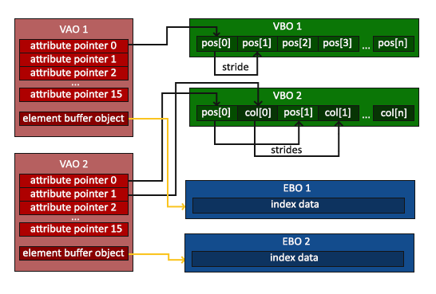

#  **BO, EBO, VBO, VAO** 
> `@think3r` 2020-04-05 12:18:42  
> 参考链接:
> 1. [learnopengl-CN 你好，三角形](https://learnopengl-cn.github.io/01%20Getting%20started/04%20Hello%20Triangle/)
> 2. [如何正确理解 opengl 的 vao ？](https://www.zhihu.com/question/30095978)

##  BO, VBO, VAO 概念详解 

1. Buffer Object, **`BO`** :
   - OpenGL 有很多缓冲对象类型，缓冲的意思是将 CPU 端的数据传送到 GPU (通过 `glBufferData()` 传递), 然后可以通过一个 ID 来进行管理和使用;
     - 使用这些缓冲对象的好处是我们可以一次性的发送一大批数据到显卡上，而不是每个顶点发送一次。从 CPU 把数据发送到显卡相对较慢，所以只要可能我们都要尝试尽量一次性发送尽可能多的数据。当数据发送至显卡的内存中后，顶点着色器几乎能立即访问顶点，这是个非常快的过程。
        - 不明白的话, 滚回去接着看上面的 openGL 客户端和服务端模式.
   - 虽然 BO 能将数据送到 GPU 端, 但 GPU 怎么使用(是颜色? 是顶点? 还是其它的索引数据?), 这些 GPU 都不知道.
2. 顶点缓冲对象：Vertex Buffer Object，**`VBO`**
   - 通过绑定 BO 至 `GL_ARRAY_BUFFER` 我们得到了 VBO, <u>VBO 确定了这是顶点数据(供顶点着色器使用). </u>
     - 但 VBO 没解释这是什么的顶点(点? 线? 三角形? 四边形?), 也说不了, 仅此而已.
       - OpenGL 需要你去指定这些数据所表示的渲染类型。我们是希望把这些数据渲染成一系列的点？一系列的三角形？还是仅仅是一个长长的线？做出的这些提示叫做**图元(Primitive)**，任何一个绘制指令的调用都将把图元传递给 OpenGL。这是其中的几个：`GL_POINTS、GL_TRIANGLES、GL_LINE_STRIP`。 *这些都是后话了.*
     - 而且 VBO 本身也没有并没有说明该如何解释(`glVertexAttribPointer()`) BO 中的数据; 即: **VBO 仅仅是 BO 的一个更具体的子类**, 仅仅表示该 BO 是 vertex 的 BO;
3. VBO 的属性指针 ( 通过 `glVertexAttribPointer()` 函数指定):
   - 一个 VBO 的属性指针包含 :
     - 数据类型 int? float?
     - 每个位置数据的个数, 3 个一组? 还是 4 个一组?
     - 数据的 stride . 
     - 数据的起始地址等等;
   - 顶点着色器的每个输入变量也叫 **顶点属性(Vertex Attribute)**. 详情参见 [GLSL.md](./GLSL.md)
   - 一个包含了属性的 VBO 可表示成下图所示 :
   
4. 顶点数组对象：Vertex Array Object，**`VAO`**, 又是对 VBO 的一次封装 ---> **( VBO 属性指针 + 配置的 VBO 的状态 + EBO)**;
   - 顶点数组对象(Vertex Array Object, VAO)可以像顶点缓冲对象那样被绑定，任何随后的顶点属性调用(`gl*VertexAttrib*()`)都会储存在这个 VAO 中。
   - 这样的**好处**就是，当配置顶点属性指针时，你只需要将那些调用执行一次，之后再绘制物体的时候只需要绑定相应的 VAO 就行了。 这使在不同顶点数据和属性配置之间切换变得非常简单，只需要绑定不同的 VAO 就行了。刚刚设置的所有状态都将存储在 VAO 中.
   
   - 一个顶点数组对象会储存以下这些内容：
      - `glEnableVertexAttribArray()` 时的启用的是哪个定点属性; `glDisableVertexAttribArray()` 关闭的顶点属性
      - 通过 `glVertexAttribPointer()` 设置的顶点属性配置。
      - 通过 `glVertexAttribPointer()` 调用与顶点属性关联的顶点缓冲对象。
      - 配置的 EBO 及其状态;
5. 索引缓冲对象：Element Buffer Object，**`EBO`** 或 Index Buffer Object，**`IBO`**
   - EBO 是减少 VBO 中顶点数量的一次变种, 同时也可以被 VAO 管理(参见上图).
  
---

**总结一下 (用结构体实现的方式去理解上述概念):**

1. BO 是 GPU 端的一个内存, 里面存放了数据;
2. VBO 将 BO 绑定至 vertex, 即 : 指明了那块内存数据是 vertex 顶点数据;
     - `glVertexAttribPointer()` 顶点属性指针, 则用来解释 VBO 中数据类型和到底该怎么划分使用;
         - <u>**配置完顶点属性指针后, 就可以直接去绘制了,**</u> 下方的 EBO, VAO, 都是附加项;
3. EBO 是也是一个 BO, 存有数据, 只不过其数据是 VBO 中顶点数据的索引, 其目的是用来减少 VBO 中数据的个数的;
4. VAO 则是一系列的指针, 这些指针分别都指向了 2 中已可以使用的顶点, 其目的是一次配置到处使用;

##  **[openGL 数据结构还原](./openGL数据结构的抽象.h)** 

---

###  BO,VAO,VBO,EBO 使用详解 

定义顶点数据以后，我们会把它作为输入发送给图形渲染管线的第一个处理阶段：顶点着色器。

- BO 会在 **GPU** 上创建内存用于储存我们的数据 ;
  - 就像 OpenGL 中的其它对象一样，这个缓冲有一个独一无二的 ID，所以我们可以使用 `glGenBuffers()` 函数和一个缓冲 ID 生成一个对象的 ID (<u>即：向状态机获取一个独一无二的 ID</u>) ：
    - `void glGenBuffers(GLsizei n,GLuint * buffers);`
- OpenGL 有很多缓冲对象类型 `GL_ARRAY_BUFFER / GL_ELEMENT_ARRAY_BUFFER / GL_PIXEL_PACK_BUFFER` 等，顶点缓冲对象的缓冲类型是 `GL_ARRAY_BUFFER`。
  - 我们可以使用 `glBindBuffer()` 函数把新创建的缓冲绑定到 `GL_ARRAY_BUFFER` 目标上(VBO) (<u>即 ：向状态机声明刚刚指定的 ID 的类型</u>) ：
    - `void glBindBuffer(GLenum target,GLuint buffer);`
  - 我们通过 **顶点缓冲对象(Vertex Buffer Objects, VBO)** <u>*管理其申请配置的内存*</u>，它会在  <u>GPU 内存（通常被称为显存）</u>中储存大量顶点。从这一刻起，我们使用的任何（在 `GL_ARRAY_BUFFER` 目标上的）缓冲调用都会用来配置当前绑定的缓冲(VBO)。
  - 然后我们可以调用 `glBufferData()` 函数，它会把之前定义的顶点数据复制到 GPU 端缓冲的内存中：`void glBufferData(GLenum target, GLsizeiptr size, const GLvoid *data, GLenum usage);`
    - 本函数用法的另一种解释: 在服务端内存中分配 size 个存储单元, 用于存储数据或者索引; 然后将数据从应用程序的数组中拷贝到 OpenGL 服务端的内存中.
    - 参数介绍:
      - 第四个参数指定了我们希望显卡如何管理给定的数据。它有三种形式：
        - `GL_STATIC_DRAW` ：数据不会或几乎不会改变。
        - `GL_DYNAMIC_DRAW`：数据会被改变很多。
        - `GL_STREAM_DRAW` ：数据每次绘制时都会改变。
      - 比如说一个缓冲中的数据将频繁被改变，那么使用的类型就是 `GL_DYNAMIC_DRAW` 或 `GL_STREAM_DRAW`，这样就能确保显卡把数据放在能够高速写入的内存部分。
  - > `void glBindBuffer(	GLenum target, GLuint buffer);`  
    - 参考链接: [glGenBuffers与glBindBuffer理解](https://blog.csdn.net/qq_36383623/article/details/85123077)
    - OpenGL 允许我们同时绑定多个缓冲，只要它们是不同的缓冲类型。**换句话说，同一时间，不能绑定两个相同类型的缓冲对象.** 比如顶点缓冲类型 `GL_ARRAY_BUFFER`，`glBufferData()` 是通过指定目标缓冲类型来进行数据传输的，而每一个目标缓冲类型再使用前要提前绑定一个缓冲对象，从而赋予这个缓冲对象一个类型的意义，如果绑定了两个相同类型的目标缓冲，数据的配置肯定就会出错。（可以这样想一下，我要把数据存入顶点缓冲区，但是顶点缓冲区可以有很多缓冲对象，我需要传入哪个呢，于是我就要提前绑定一个，之后，我只要向顶点缓冲区内传入数据，这个数据就会自动进入被绑定的那个对象里面）.
- 还要配置 OpenGL 如何解释这些内存，即: 手动指定输入数据的哪一个部分对应 *顶点着色器* 的哪一个顶点属性:
  - `void glVertexAttribPointer（GLuint index, GLint size, GLenum type, GLboolean normalized, GLsizei stride, const GLvoid * pointer）;`
    - 第一个参数指定我们要配置的顶点属性。还记得我们在**顶点着色器**中使用 `layout(location = 0)` 定义了 position 顶点属性的位置值(Location)吗？它可以把顶点属性的位置值设置为 0。因为我们希望把数据传递到这一个顶点属性中，所以这里我们传入 `0`。
    - 第二个参数指定顶点属性的大小。顶点属性是一个 `vec3`，它由 3 个值组成，所以大小是 3。
    - 第三个参数指定数据的类型，这里是 `GL_FLOAT` (**GLSL 中 vec\* 都是由浮点数值组成的**)。
    - 下个参数定义我们是否希望数据被标准化(Normalize)。如果我们设置为 `GL_TRUE`，所有数据都会被映射到 0（对于有符号型 signed 数据是 -1）到 1 之间。我们把它设置为 `GL_FALSE`。
    - 第五个参数叫做步长(Stride)，它告诉我们在连续的顶点属性组之间的间隔。
      - 由于下个组位置数据在3 个 float 之后，我们把步长设置为 `3 * sizeof(float)` 。
      - 要注意的是由于我们知道这个数组是紧密排列的（在两个顶点属性之间没有空隙）我们也可以设置为 `0` 来让 OpenGL 决定具体步长是多少（只有当数值是紧密排列时才可用）。
      - 一旦我们有更多的顶点属性，我们就必须更小心地定义每个顶点属性之间的间隔，我们在后面会看到更多的例子（译注: 这个参数的意思简单说就是从这个属性第二次出现的地方到整个数组0位置之间有多少字节）。
    - 最后一个参数的类型是 `void *` ，所以需要我们进行这个奇怪的强制类型转换。它表示位置数据在缓冲中起始位置的偏移量(Offset)。由于位置数据在数组的开头，所以这里是 0。我们会在后面详细解释这个参数。
      - 使用 VBO 时, 每个顶点属性从一个 VBO 管理的内存中获得它的数据，而具体是从哪个 VBO（程序中可以有多个 VBO）获取则是通过在调用 `glVertexAttribPointer()` 时绑定到 `GL_ARRAY_BUFFER` 的 VBO 决定的。由于在调用 `glVertexAttribPointer` 之前绑定的是先前定义的 VBO 对象，顶点属性 0 现在会链接到它的顶点数据。
      - > [GLES2.0中文API-glBindBuffer](https://blog.csdn.net/flycatdeng/article/details/82664520) 
      - > When vertex array pointer state is changed by a call to glVertexAttribPointer, the current buffer object binding (GL_ARRAY_BUFFER_BINDING) is copied into the corresponding client state for the vertex attrib array being changed, one of the indexed GL_VERTEX_ATTRIB_ARRAY_BUFFER_BINDINGs. While a non-zero buffer object is bound to the GL_ARRAY_BUFFER target, the vertex array pointer parameter that is traditionally interpreted as a pointer to <u>client-side memory</u> is instead interpreted as an offset within the buffer object measured in basic machine units.
      - > 即 `glVertexAttribPointer()` 原本的最后一个参数是顶点属性数组的指针. 但, 当绑定 VBO 后，最后一个参数就是指向所绑定的 VBO 的一个地址了. (*只有 OGL-ES 中有这个特性*)
      - 具体的例子 : [demo-triangle-indexed](../code/triangle_indxed/triangle_indxed.c)
- 并且指定其如何发送给显卡。
- 使能服务端对该数据的访问 `glEnableVertexAttribArray()` :
  > [OpenGL-ES 3.0 glEnableVertexAttribArray的作用](https://www.jianshu.com/p/b05884a0ff8e/)
  - 对于 OpenGL-ES 3.0，可使用至少 16 个顶点属性, 默认情况下，出于性能考虑，所有顶点着色器的属性（Attribute）变量都是关闭的，意味着数据在着色器端是不可见的，哪怕数据已经上传到 GPU.
  - 数据在 GPU 端是否可见，即，着色器能否读取到数据，由是否启用了对应的属性决定，这就是 `glEnableVertexAttribArray()` 的功能，允许顶点着色器读取 GPU（服务器端）数据. 由 `glEnableVertexAttribArray()` 启用指定属性，才可在顶点着色器中访问逐顶点的属性数据。
  - 那么，`glEnableVertexAttribArray()` 应该在 `glVertexAttribPointer()` 之前还是之后调用？答案是都可以，只要在绘图调用（ `glDraw*` 系列函数）前调用即可。

---

##  **FrameBuffer 帧缓冲** 

> 1. [帧缓冲](https://learnopengl-cn.github.io/04%20Advanced%20OpenGL/05%20Framebuffers/)
> 2. [OpenGL ES 2.0 知识串讲十一---ES详解5（FBO）](https://zhuanlan.zhihu.com/p/359624389)

1. 屏幕缓冲(属于帧缓冲的一种) :
   - 颜色缓冲
   - 深度缓冲
   - 模版缓冲(根据一些条件丢弃特定片段)
2. 上述缓冲可分为 :
   1. 默认的 : 创建窗口时默认生成和配置的 (window-system-provided framebuffer)
      - 由 EGL 创建, 无法被 OpenGL-ES 控制
      - window-system-provided framebuffer被创建的时候会关联一些color buffer、depth buffer（如果有）、stencil buffer（如果有）
   2. 自定义(application-created framebuffer) : OpenGL 允许我们定义自己的帧缓冲(包括 1 中的三种)
      - 由于我们的帧缓冲不是默认帧缓冲，渲染指令将不会对窗口的视觉输出有任何影响。
      - 出于这个原因，渲染到一个不同的帧缓冲被叫做离屏渲染(Off-screen Rendering)。
      - 要保证所有的渲染操作在主窗口中有视觉效果，我们需要再次激活默认帧缓冲，将它绑定到 0 :  `glBindFramebuffer(GL_FRAMEBUFFER, 0);` ---> 解绑帧缓冲.
3. **一个完整的帧缓冲条件 :**
   1. 附加至少一个缓冲（颜色、深度或模板缓冲）。
   2. 至少有一个颜色附件(Attachment)。
      - 附件是一个内存位置, 它能够作为帧缓冲的一个缓冲，可以将它想象为一个图像。
      - 当创建一个附件的时候我们有两个选项：纹理或渲染缓冲对象(Renderbuffer Object)。
        - 纹理 : 
          - 当把一个纹理附加到帧缓冲的时候，所有的渲染指令将会写入到这个纹理中，就像它是一个普通的颜色/深度或模板缓冲一样。
          - 使用纹理的优点是，所有渲染操作的结果将会被储存在一个纹理图像中，我们之后可以在着色器中很方便地使用它。
   3. 所有的附件都必须是完整的（保留了内存）。
   4. 每个缓冲都应该有相同的样本数。
   - 完整帧缓冲的检测 : `glCheckFramebufferStatus(GL_FRAMEBUFFER) == GL_FRAMEBUFFER_COMPLETE`
4. 使用 :
   1. 生成 `glGenFramebuffers (GLsizei n, GLuint *framebuffers);`
   2. 绑定 target : `glBindFramebuffer (GLenum target, GLuint framebuffer);`, 可选类型 :
      - `GL_FRAMEBUFFER` : 所有的读取和写入帧缓冲的操作将会影响当前绑定的帧缓冲 (一般的选择)
      - `GL_READ_FRAMEBUFFER` : 像是 `glReadPixels` 的读取操作
      - `GL_DRAW_FRAMEBUFFER` : 被用作渲染、清除等写入操作的目标
   3. 附件 :
      1. 纹理附件 : PS : 被 attach 到当前 FBO 上的 texture，不能作为 shader 的输入 texture，否则就会出现从 texture 中读取信息，然后再写入该 texture 的问题
         1. 创建普通纹理 :
            1. `glGenTextures`
            2. `glBindTexture`
            3. `glTexImage2D(GL_TEXTURE_2D, 0, GL_RGB, 800, 600, 0, GL_RGB, GL_UNSIGNED_BYTE, NULL);`
               - 大小可以配置为屏幕的大小
               - 数据 data 为 null
            4. `glTexParameteri` ...
         2. 将纹理附加到帧缓冲(颜色缓冲) : `glFramebufferTexture2D(GL_FRAMEBUFFER, GL_COLOR_ATTACHMENT0, GL_TEXTURE_2D, texture, 0);`
            - target：帧缓冲的目标（绘制、读取或者两者皆有）
              - 深度缓冲为 `GL_DEPTH_ATTACHMENT`
              - 模版缓冲 `GL_STENCIL_ATTACHMENT`
            - attachment：我们想要附加的附件类型。当前我们正在附加一个颜色附件。注意最后的0意味着我们可以附加多个颜色附件。我们将在之后的教程中提到。
            - textarget：你希望附加的纹理类型, 
              - 深度缓冲 `GL_DEPTH_COMPONENT`
              - 模版缓冲 : `GL_DEPTH_COMPONENT`
            - texture：要附加的纹理本身
            - level：多级渐远纹理的级别。我们将它保留为 0
      2. 渲染缓冲对象附件 :
         1. 优缺点 :
            1. 渲染缓冲对象(Renderbuffer Object)是在纹理之后引入到OpenGL中，作为一个可用的帧缓冲附件类型的，所以在过去纹理是唯一可用的附件。
            2. 和纹理图像一样，渲染缓冲对象是一个真正的缓冲，即一系列的字节、整数、像素等。
            3. 渲染缓冲对象附加的好处是，它会将数据储存为 OpenGL 原生的渲染格式，它是为离屏渲染到帧缓冲优化过的。
               - 因为它的数据已经是原生的格式了，当写入或者复制它的数据到其它缓冲中时是非常快的。所以，交换缓冲这样的操作在使用渲染缓冲对象时会非常快。 
               - 我们在每个渲染迭代最后使用的 glfwSwapBuffers，也可以通过渲染缓冲对象实现：只需要写入一个渲染缓冲图像，并在最后交换到另外一个渲染缓冲就可以了。渲染缓冲对象对这种操作非常完美。
                 - 类似于 iOS 的 `[context presentRenderbuffer : GL_RENDERBUFFER]` ???
            4. 渲染缓冲对象直接将所有的渲染数据储存到它的缓冲中，不会做任何针对纹理格式的转换，让它变为一个更快的可写储存介质。然而，渲染缓冲对象通常都是只写的，所以你不能读取它们（比如使用纹理访问）。
               - 当然你仍然还是能够使用 `glReadPixels` 来读取它，这会从当前绑定的帧缓冲，而不是附件本身，中返回特定区域的像素。
         2. 创建 : `glGenRenderbuffers`
         3. 给 RBO 创建、初始化存储空间 : `glBindRenderbuffer(GL_RENDERBUFFER, rbo);`
            - 由于渲染缓冲对象通常都是只写的，它们会经常用于深度和模板附件，因为大部分时间我们(用户端 -- CPU)都不需要从深度和模板缓冲中读取值，只关心深度和模板测试。
            - 我们需要深度和模板值用于测试，但不需要对它们进行采样，所以渲染缓冲对象非常适合它们。
            - 当我们不需要从这些缓冲中采样的时候，通常都会选择渲染缓冲对象，因为它会更优化一点。
         4. 数据格式指定 : `glRenderbufferStorage(GL_RENDERBUFFER, GL_DEPTH24_STENCIL8, 800, 600);`
            - `GL_DEPTH24_STENCIL8` : 封装了 24 位的深度和 8 位的模板缓冲
         5. 附加渲染缓冲对象 : `glFramebufferRenderbuffer(GL_FRAMEBUFFER, GL_DEPTH_STENCIL_ATTACHMENT, GL_RENDERBUFFER, rbo);`
5. window-system-provided framebuffer 和application-created framebuffer的最主要的区别 :
   1. FBO 的 attachment 可以修改。在 OpenGL ES2.0 中 FBO 只能有一个 color attachmen t挂载点GL_COLOR_ATTACHMENT0、一个 depth attachment 挂载点 GL_DEPTH_ATTACHMENT、一个 stencil attachment 挂载点GL_STENCIL_ATTACHMENT，而这三个挂载点初始都为 GL_NONE，需要通过API glFramebufferRenderbuffer 和 glFramebufferTexture2D 手动挂载。
   2. ~~无论读取还是写入，像素所有权测试总是通过 ????~~
   3. FBO 的 buffer 无法像 framebuffer 那样可以被 swap 到屏幕上，所以 OpenGL ES 针对这种绘制叫做 off-screen rendering。
   4. 没有 multisample buffer，所以针对 FBO 的 GL_SAMPLES 和 GL_SAMPLE_BUFFERS 均为 0。
6. renderbuffer :
   1. 就是 FBO 上关联的一块 buffer（texture也可以）。
   2. renderbuffer 是由 OpenGL ES 创建和管理的，所以可以随意的将其与 FBO 进行 attach 和 detach，甚至可以将其与多个 FBO 绑定，这样可以避免了数据 copy 以及减少了内存浪费。这一点 window-system-provided framebuffer 就做不到。
   3. renderbuffer 被 attach 到 FBO 上后，当该 FBO active 后，这块 renderbuffer 就被作为 OpenGL ES 实际绘制和读取的目标。
