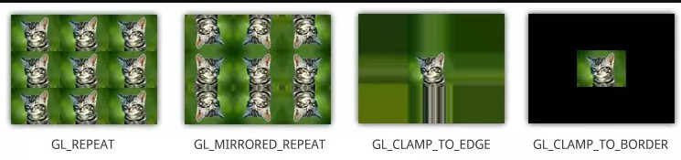

# <font color=#0099ff> **纹理** </font>

> `@think3r` 2020-04-05 22:01:35

## <font color=#009A000> **纹理简介** </font>

纹理的由来 : 我们可以为每个顶点添加颜色来增加图形的细节，从而创建出有趣的图像。但是，<u>**如果想让图形看起来更真实，我们就必须有足够多的顶点，从而指定足够多的颜色。这将会产生很多额外开销，因为每个模型都会需求更多的顶点，每个顶点又需求一个颜色属性。**</u> 艺术家和程序员更喜欢使用纹理(Texture)。

**为了能够把纹理映射(Map)到三角形上，我们需要指定三角形的每个顶点各自对应纹理的哪个部分。这样每个顶点就会关联着一个纹理坐标(Texture Coordinate)，用来标明该从纹理图像的哪个部分采样（译注：采集片段颜色）。之后在图形的其它片段上进行片段插值(Fragment Interpolation)。**

纹理渲染首先都是需要在图元绘制的基础上运行的.(基本的图元: 点, 线, 三角形!)这个可以由纹理的定义来看出: 

- 纹理(Texture) ：一种**包裹着物体**的特殊类型图像，给物体精细的视觉效果

所以, 对于 YUV 格式的处理, 我们首先需要进行图元的绘制, 然后再把纹理贴图到图元上, 没有图元, 纹理无从谈起!(实际中, 我们的代码顺序刚好相反, 先配置纹理贴图数据, 然后再绘制图元: 由两个三角形组成的四边形图元)

```c
glBindTexture(GL_TEXTURE_2D, texture);
glDrawElements(GL_TRIANGLES, 6, GL_UNSIGNED_INT, 0);
```

<u>**纹理(texture) 坐标(coords)** 起始于(0, 0)，也就是纹理图片的左下角，终始于(1, 1)，即纹理图片的右上角。</u>

```c
// 1. 生成/创建纹理, 并得到对应的 ID.
void glGenTextures( 
        GLsizei n,           /* 指定要生成的纹理 ID 的数量。*/
        GLuint * textures);  /* 指定存储生成的纹理 ID 的数组。 */

// 2. 绑定纹理, 解释纹理是一维, 二维, 还是其它
void glBindTexture(
        GLenum target,  /*     指定之前激活了的纹理要绑定到的一个目标。
                        必须是 GL_TEXTURE_2D 或 GL_TEXTURE_CUBE_MAP。 */
        GLuint texture); /*     指定纹理 ID。 */

// 3. 使用 glUniform1i 设置每个采样器的方式告诉 OpenGL 每个着色器采样器属于哪个纹理单元。
glUniform1i(glGetUniformLocation(program, "texture0"), 0); /* GL_TEXTURE0 */
glUniform1i(glGetUniformLocation(program, "texture1"), 1); /* GL_TEXTURE1 */

// 4. 为当前绑定的纹理对象设置环绕、过滤方式
glTexParameteri(GL_TEXTURE_2D, GL_TEXTURE_WRAP_S, GL_REPEAT);
glTexParameteri(GL_TEXTURE_2D, GL_TEXTURE_WRAP_T, GL_REPEAT);
glTexParameteri(GL_TEXTURE_2D, GL_TEXTURE_MIN_FILTER, GL_LINEAR);
glTexParameteri(GL_TEXTURE_2D, GL_TEXTURE_MAG_FILTER, GL_LINEAR);

// 5. 加载纹理的内容, 加载后可删除源数据 [OpenGL-ES2.0/3.0 glTexImage2D 函数详解](https://blog.csdn.net/jeffasd/article/details/78135588)
void glTexImage2D(
       GLenum target,   /* 维度 */
　　　　GLint level,    /* 理指定多级渐远纹理的级别，一般为 0 */
　　　　GLint internalFormat,   /* 指的是纹理数据在 OpenGL 中是如何表示的， 如 GL_RGB 
                                  就表示纹理的像素在 OpenGL 里面以红绿蓝三个分量表示，
                                  在纹理图像加载过程中不支持格式间的转换。 */
　　　　GLsizei height,
　　　　GLint border,   /* 应该总是被设为 0（历史遗留的问题） */
　　　　GLenum format,  /* 载入纹理的格式，它告诉 OpenGL
                          外部数据是如何存储每个像素数据的 */
　　　　GLenum type,    /* 组成图像的数据是无符号字节类型 */
　　　　const GLvoid * data); /* 图像数据 */
// data可能是一个空指针。在这种情况下，会分配纹理内存以适应宽度width和高度的纹理height。 ???????????????

// 6. 现在只剩下在调用 glDrawElements 之前绑定纹理了，它会自动把纹理赋值给片段着色器的采样器：
/* 使用第一个纹理 */
glActiveTexture(GL_TEXTURE0); // 在绑定纹理之前先激活纹理单元
glBindTexture(GL_TEXTURE_2D, texture0); // texture0 <--> GL_TEXTURE0
/* 使用第二个纹理*/
glActiveTexture(GL_TEXTURE1);
glBindTexture(GL_TEXTURE_2D, texture1); // texture1 <--> GL_TEXTURE1
```

我们能够在一个片段着色器中设置多个纹理。OpenGL 至少保证有 16 个纹理单元供你使用，也就是说你可以激活从 `GL_TEXTURE0` 到 `GL_TEXTRUE15`。它们都是按顺序定义的，所以我们也可以通过 `GL_TEXTURE0 + 8` 的方式获得 `GL_TEXTURE8` ，这在当我们需要循环一些纹理单元的时候会很有用。

一个纹理的位置值通常称为一个纹理单元(Texture Unit)。一个纹理的默认纹理单元是 `0` (`GL_TEXTURE0`)，它是默认的激活纹理单元. 纹理是全局的, 在 shaders 中定义了纹理后, 需要对纹理单元进行排序赋值, 这样使用的时候就能使用 GL_TEXTURE0 之类的了. 而这个绑定, 只需要一次.

<u>*这里主要有两个纹理参数:*</u>

1. 一个是 `glGenTextures()` 生成的纹理 `ID(texture0)`. 此 `ID` 主要用于 openGL 程序中对纹理进行参数配置等, 可以理解为 openGL 状态机中的纹理 `ID`.
2. 第二个为 `GL_TEXTURE0`, 这个是 GLSL 着色器程序中的纹理名字. 
3. 在通过第一个 `ID` 配置好纹理的参数后, 需要传递到 GLSL 的中使用, 两者的对照绑定如上步骤 6 所示.

### <font color=#FF4500> 纹理参数 </font>

> 1. [OpenGL纹理详解（上）](https://www.jianshu.com/p/1829b4acc58d)
> 2. [OpenGL--------纹理处理](https://www.cnblogs.com/Anita9002/p/4410235.html)

通过纹理坐标获取像素颜色信息的过程称为采样，而采样的结果会根据纹理参数设置的不同而千差万别。OpenGL 中设置纹理参数的 API 接口为 `glTextureParameter()`，我们所有的纹理参数都由这个接口设置，下面我们介绍几种常用的纹理参数的配置。

1. **环绕方式 (warp) :** 纹理坐标的范围与 OpenGL 的屏幕坐标范围一样，是 0-1。超出这一范围的坐标将被 OpenGL 根据 GL_TEXTURE_WRAP 参数的值进行处理:
   - `GL_TEXTURE_WRAP_S` 横轴 x 方向, `GL_TEXTURE_WRAP_T` 纵轴 y 方向;
     - `GL_REPEAT` 犹如字面意思那样会重复，当几何纹理坐标大于 1.0 的时候，他取的纹理坐标的值位于纹理坐标减去 1.0 的位置，如纹理坐标是 1.1 的时候，他取的颜色的值是 0.1。所以 1.0 和 2.0 一样，1.1 和 0.1 一样，所以就会重复，就向字面意思那样。
     - `GL_MIRRORED_REPEAT`: 超出纹理范围的坐标整数部分被忽略，但当整数部分为奇数时进行取反，形成镜像效果。
     - `GL_CLAMP_TO_EDGE` :超出纹理范围的坐标被截取成0和1，形成纹理边缘延伸的效果。
     - `GL_CLAMP_TO_BORDER` : 超出纹理范围的部分被设置为边缘色。
       - 如果我们将 wrapping 模式设置为 `GL_CLAMP_TO_BORDER`，我们需要单独设置另一属性----边界颜色, 如下：
        ````c 
        float color[4] = {1.0f, 1.0f, 1.0f, 1.0f};
        glTextureParameter(GL_TEXTURE_2D, GL_TEXTURE_BORDER_COLOR, color)
        ````



---

2. **过滤**:   由于纹理坐标和我们当前的屏幕分辨率是无关的，所以当我们为一个模型贴纹理时，往往会遇到纹理尺寸与模型尺寸不符的情况，这时，纹理会因为缩放而失真。处理这一失真的过程我们称为过滤，在OpenGL中我们有如下几种常用的过滤手段：
     - `GL_TEXTURE_MAG_FILTER`：指当纹理图象被使用到一个大于它的形状上时（即：有可能纹理图象中的一个像素会被应用到实际绘制时的多个像素。例如将一幅 `256*256` 的纹理图象应用到一个`512*512` 的正方形），应该如何处理。
     - `GL_TEXTURE_MAG_FILTER`：指当纹理图象被使用到一个大于它的形状上时（即：有可能纹理图象中的一个像素会被应用到实际绘制时的多个像素。例如将一幅 `256*256` 的纹理图象应用到一个`512*512` 的正方形），应该如何处理。
     - 可选择的设置有:
       - `GL_NEAREST`: 最临近过滤，获得最靠近纹理坐标点的像素。
       - `GL_LINEAR`: 线性插值过滤，获取坐标点附近 4 个像素的加权平均值。
       - 以及用于 mipmap 的四个参数: `GL_NEAREST_MIPMAP_NEAREST` ,  `GL_LINEAR_MIPMAP_NEAREST`, `GL_NEAREST_MIPMAP_LINEAR`, `GL_LINEAR_MIPMAP_LINEAR` ;


---

3. **多级渐远纹理 (Mipmap)** : 用来解决同一物体在不同大小时的渲染效率; 它简单来说就是一系列的纹理图像，后一个纹理图像是前一个的二分之一。
   - 多级渐远纹理背后的理念很简单：
     - 距观察者的距离超过一定的阈值，OpenGL 会使用不同的多级渐远纹理，即最适合物体的距离的那个。
     - 由于距离远，解析度不高也不会被用户注意到。
     - 同时，多级渐远纹理另一加分之处是它的性能非常好
   - OpenGL有一个 `glGenerateMipmaps()` 函数，在创建完一个纹理后调用它 OpenGL 就会承担接下来的所有工作了。
   - 切换多级渐远纹理级别时容易产生不真实的生硬边界, 此时你可以通过 `glTexParameteri()` 函数在两个不同多级渐远纹理级别之间使用 NEAREST 和 LINEAR 过滤 :
     - `GL_NEAREST_MIPMAP_NEAREST`
     - `GL_LINEAR_MIPMAP_NEAREST`
     - `GL_NEAREST_MIPMAP_LINEAR`
     - `GL_LINEAR_MIPMAP_LINEAR`
   - 一个常见的错误是，将放大过滤的选项设置为多级渐远纹理过滤选项之一。这样没有任何效果，因为**多级渐远纹理主要是使用在纹理被缩小的情况下的**：纹理放大不会使用多级渐远纹理，为放大过滤设置多级渐远纹理的选项会产生一个 `GL_INVALID_ENUM` 错误代码。


