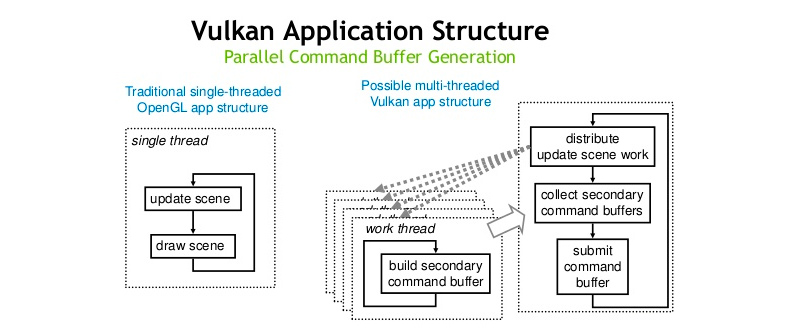

#  **learn Vulkan** 

> `@think3r` 2023-01-12 14:47:47
> 1. [Metal、Vulkan、Direct3D 12三大图形引擎架构演进](https://www.cnblogs.com/taylorshi/p/15945916.html)
> 2. [游戏引擎随笔 0x08：现代图形 API 实战回顾-Metal 篇](https://zhuanlan.zhihu.com/p/114072278)

##  0x00 简介 

1. Vulkan 是一个低开销、跨平台的 API，是 3D 图形和计算的开放标准。Vulkan 的目标是高性能实时3D图形应用，如视频游戏和互动媒体。
   1. 与旧的 OpenGL 和 Direct3D 11 API 相比，Vulkan 旨在提供更高的性能和更平衡的 CPU 和 GPU 使用。
   2. 它为应用程序提供了一个相当低级别的 API 和并行任务，与 Metal 和 Direct3D 12 相当。
   3. 除了较低的 CPU 使用率外，Vulkan 还被设计为允许开发者在多个 CPU 核心之间更好地分配工作。
2. Vulkan 是由非营利组织 Khronos Group 在 2015 年 GDC 上首次宣布的。
   1. Vulkan API 最初被 Khronos 称为 "下一代OpenGL计划"，或 "OpenGL next"，但在 Vulkan 宣布后，这些名称被停止使用了。
   2. Vulkan 源于并建立在 AMD 的 `Mantle API` 的基础上，该 API 是由 AMD 捐赠给 Khronos 的，目的是给 Khronos 一个基础，在此基础上开始开发一个低级别的 API，他们可以对整个行业进行标准化。
   3. Vulkan 并不向后兼容 OpenGL。
   4. OpenGL 和 Vulkan 都是渲染API。在这两种情况下，GPU 执行着色器，而 CPU 执行其他一切。
3. 区别和联系 :
   1. OpenGL/OpenGL ES 是单线程的。
   2. Metal & Vulkan 在 Device & Command Queue & CommandBuffer & RenderEncoder(Pipeline & Descriptor)等的概念上如此一致
   3. 在线程同步问题上，需要注意的是 Vulkan 的 events & Semaphores & Fences 和 Metal 的MTLFence & MTLEvent在颗粒度上的概念有所不同，但是完成的同步事情是一致的。

##  0x01 基础概念 

